# Media_Agent —— 自媒体 AI 创作全流程平台

> 课案实现：《3.自媒体Agent》
>
> **本地模型已全部替换为外部 API** —— 本机不需要 GPU，也不下载任何模型权重。

一个把自媒体运营全链路串起来的多智能体应用：**账号定位 → 热点选题 → 内容复刻 → 口播视频 → 后期剪辑 → 数据复盘**。
前端 Streamlit，工作流 LangGraph，剪辑环节交给 DeepAgents。

## 目录

- [与课案最大的差异：三个本地模型换成了百炼托管 API](#与课案最大的差异三个本地模型换成了百炼托管-api)
- [系统架构](#系统架构) —— 三层结构 / 数据流 / 配置加载 / 模型映射 / 素材托管 / 自检体系 / 产物落盘（**7 张图**）
- [快速开始](#快速开始) —— 环境准备 / 配置密钥 / 启动 / 自检
- [目录结构](#目录结构)
- [六大模块（知识点索引）](#六大模块知识点索引) —— 每节配一张链路图
- [配置项清单（全部在根 .env）](#配置项清单全部在根-env)
- [如何新增一个模块](#如何新增一个模块)
- [常见问题](#常见问题)
- [相关文档](#相关文档)

---

## 与课案最大的差异：三个本地模型换成了百炼托管 API

课案原本要本地部署三个深度模型（分别在 AutoDL GPU 实例上跑），本项目全部换成阿里云百炼的托管接口：

| 课案本地部署 | 本项目替换为 | 接口 |
|---|---|---|
| **FunASR** `Fun-ASR-Nano-2512` + `fsmn-vad`<br>（纯文本转写） | 百炼 **Qwen-Audio-3.0-ASR-Flash**（Fun-ASR 家族的云托管版；模型名由 `MEDIA_ASR_MODEL` 决定，默认即 `qwen-audio-3.0-asr-flash`） | `POST {base}/services/aigc/multimodal-generation/generation` |
| **FunASR** `seaco-paraformer-large` + `fsmn-vad` + `ct-punc`<br>（句级/词级时间戳，生成 SRT） | **同一个接口** | 返回 `output.sentence.begin_time/end_time` + `words[].punctuation` |
| **Fish-Speech 1.5**（声音克隆 TTS） | 百炼 **CosyVoice 声音复刻** | `VoiceEnrollmentService.create_voice()` + `SpeechSynthesizer.call()` |
| **HeyGem / Duix Avatar**（唇形驱动） | 百炼 **爱诗 PixVerse 视频对口型** | `VideoSynthesis.async_call(model="pixverse/pixverse-lipsync", media=[...])` |

**一个接口替掉了课案的两个 FunASR 模型** —— 百炼的 ASR 同时提供纯文本与句级+词级时间戳。

另外补了课案没有的一环：**本地文件 → 公网 URL**。
百炼的多个接口只收公网可访问 URL，而素材都在本地。这里有**两条路**，实测各有适用面：

| 方式 | 模块 | 产出 | 适用 | 实测结论 |
|---|---|---|---|---|
| 百炼免费临时存储 | `tools/dashscope_upload.py` | `oss://…`（48h） | 多模态 / 图像 / 视频类接口；**数字人对口型的 `video_url` / `audio_url`**；音频超过 10MB 时的 ASR | ⚠️ **CosyVoice 不收**（400 `audio url should start with http or https`） |
| 自建静态托管 | `tools/asset_host.py` | `http(s)://…` | 声音克隆（必需）—— **只有这一处需要** | ✅ 实测可用 |

自建托管的做法：把本地素材 `scp` 到自己的服务器静态目录，nginx 只读分发。
服务器侧只需要一个 location（上传走 scp，**不需要写权限**）：

```nginx
location /media-assets/ { alias /var/www/media-assets/; autoindex off; }
```

> ⚠️ **声音克隆必须用自建托管**（或任何真正的 http(s) 地址）——
> CosyVoice 的 `create_voice` 明确拒绝 `oss://`。
> ASR 默认走 Base64 Data URI（≤ `MEDIA_ASR_INLINE_MAX_BYTES`，默认 10MB），
> 超过才先上传百炼临时存储换成 `oss://` —— 两种情形**都不依赖自建托管**。

### 保留原样的部分（本来就不是"模型"）

`ffmpeg`、`moviepy`、`HyperFrames`(npm)、`yt-dlp`、`trafilatura`、`tavily`/NewsNow 热点 API、Edge-TTS。

课案的 Windows 适配代码**全部保留**：UTF-8 重配置、`subprocess.Popen` monkey-patch、
`normalize_path()`（修 Git Bash 畸形路径）、`MSYS_NO_PATHCONV`、`LocalShellBackend._resolve_path` 补丁。

---

## 系统架构

### 1. 三层架构总览

整个项目就三层，**依赖方向永远是单向的**（页面 → 工作流 → 工具），
所以每一层都能单独测：工作流不依赖 Streamlit，工具不依赖工作流。

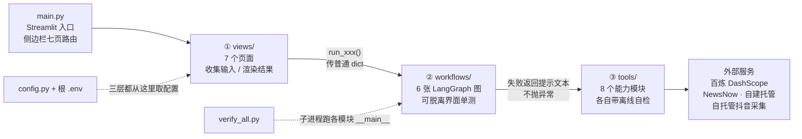

**每一层放什么、失败时怎么办**（细节见下面的「目录结构」与各模块小节）：

| 层 | 内容 | 谁来调 | 失败时怎么办 |
|---|---|---|---|
| ① 界面层 `views/` | `home` · `positioning` · `hot_topic` · `replicate` · `video` · `mashup` · `review`（7 个页面） | `main.py` 的侧边栏路由 | 把返回值里的提示文案渲染成 `st.error` / `st.warning` |
| ② 工作流层 `workflows/` | 六张 LangGraph 图 + `__init__`（LLM 统一入口）/ `base`（别名转发） | 页面上的按钮 | 节点内兜住异常、回填中文失败标记，**不让异常冒到页面** |
| ③ 工具层 `tools/` | `trend_radar_client` · `media_tools` · `audio_transcriber` · `dashscope_upload` · `asset_host` · `voice_clone` · `avatar_client` · `douyin_client`（8 个） | 工作流节点 | 返回 `""` 或 `{"success": False}`，把原因打进日志 |

**为什么这么分层**：`views/` 里的页面函数只做「收集输入 → 调 `workflows.run_*()` → 渲染 dict」，
一旦把业务逻辑写进页面就没法脱离界面测试了；`tools/` 里每个文件是**独立可运行的**，
末尾都有 `if __name__ == "__main__":` 离线自检，可以单独跑。

### 2. 一次请求的完整数据流

以「内容复刻」为例，从点击按钮到页面出结果：

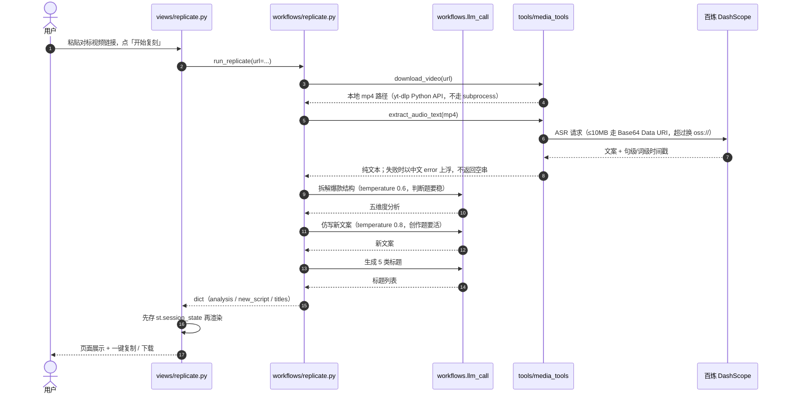

> ⚠️ 最后两步的顺序不能反：`st.download_button` 一被点击就触发**整页 rerun**，
> 结果不先落进 `st.session_state` 的话，页面会当场变空白。
> 这是课案反复强调的坑，七个页面全都遵守。

### 3. 配置是怎么进来的

配置全部走根目录一套，Media_Agent **不维护第二份**：

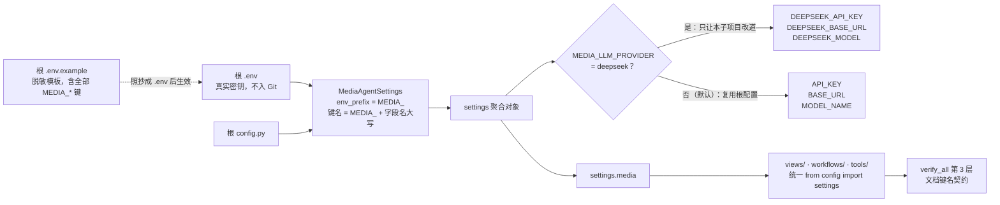

> ⚠️ **键名是 `env_prefix` 拼出来的，写错不会报错**：字段名与文档里的键对不上时，
> 那个键被静默忽略、只剩代码默认值生效（默认值恰好等于期望值时表面完全看不出）。
> 所以 `verify_all.py` 第 3 层加了一条机器校验：
> `.env.example` 里出现过的每个 `MEDIA_*`（注释态的也算）都必须真能被 pydantic 读到。

**为什么复用根配置**：`.pth` 文件（`.venv/Lib/site-packages/python_base_root.pth`）
把仓库根加进了 `sys.path`，所以任何子目录里都能直接 `from config import settings`，
不需要每个子项目各写一份配置类。

### 4. 模型替代映射

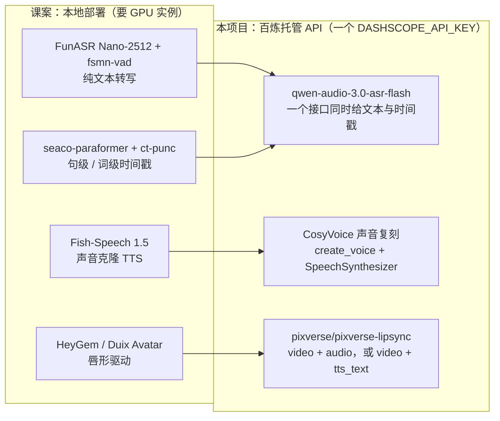

本机不需要 GPU、不下载任何权重；**保留本地不动的**是那些本来就不是"模型"的组件：
`ffmpeg`、`moviepy`、`HyperFrames`(npm)、`yt-dlp`、`trafilatura`、Edge-TTS。

### 5. 本地素材怎么变成接口能收的地址

百炼的多个接口只认公网可访问的 URL，而素材都在本地。分流规则如下：

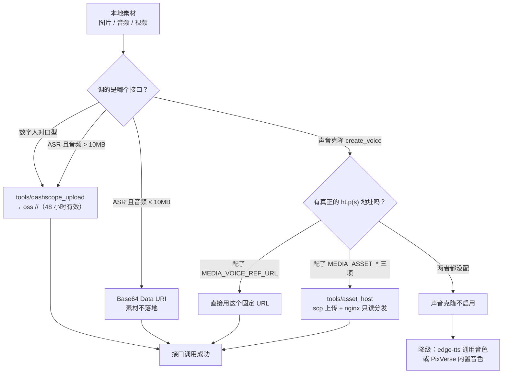

> ⚠️ **只有 `create_voice` 认不了 `oss://`**（实测 400 `audio url should start with http or https`），
> 所以自建托管只需要为声音克隆准备；数字人**不需要**。

### 6. 自检体系

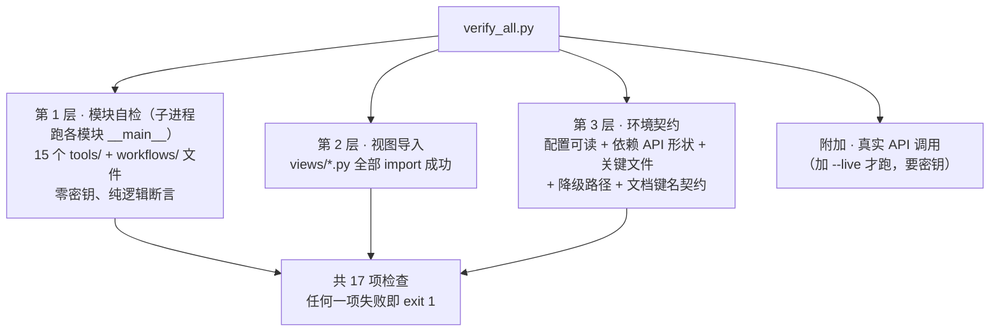

**离线也必须全绿**是这个项目的验收底线：所有自检都不联网、不消耗额度，
包括需要付费接口的那几个模块（用打桩顶掉真实导入）。

### 7. 运行时产物落在哪

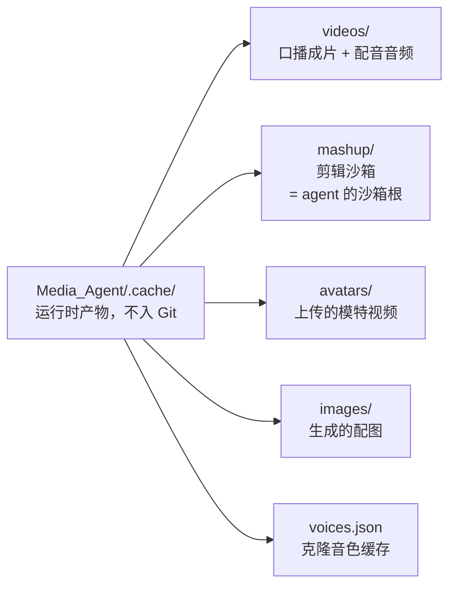

`videos/downloads/` 放下载回来的对标视频；`mashup/` 里的中间产物收在 `_scratch/` 下。
这些目录都能用 `MEDIA_*_DIR` 覆盖，不配就用 `.cache` 下的默认绝对路径。

> ⚠️ `voices.json` **不能删也不能每次重建**：CosyVoice 建音色有配额，
> 丢了缓存会重新占用名额（指纹按 `路径 + 大小 + 修改时间` 算，所以移动源文件会重新建）。

---

## 快速开始

### 1. 环境准备

本仓库**共用根目录的 `.venv` 与根 `config.py`**（见仓库根 README）。
Media_Agent 不建自己的虚拟环境，也不写自己的配置类。

```powershell
# 在仓库根目录 F:\ProGram\Python_Base 下
uv sync
```

Windows 上还需要（首次部署时做一次）：

```powershell
# 视频转码 / 音频提取 / 最终渲染都要用
winget install ffmpeg

# HyperFrames：HTML/CSS/GSAP → MP4 动画素材（可选）
# ⚠️ 本机实测：CLI 能装能用（npx --yes hyperframes --version → 0.8.46），
#    但 init/render 会卡到 300s 超时（浏览器依赖拉不下来）。
#    所以 MEDIA_MASHUP_USE_HYPERFRAMES 默认 false，走 moviepy 分支。
npm install --cache .npm-cache hyperframes
```

### 2. 配置密钥

**所有配置都在仓库根目录的三个文件里**，Media_Agent 不额外维护配置：

| 文件 | 作用 |
|---|---|
| `F:\ProGram\Python_Base\.env` | 真实密钥（不入 Git） |
| `F:\ProGram\Python_Base\.env.example` | 脱敏模板 |
| `F:\ProGram\Python_Base\config.py` | 配置读取（`settings` / `settings.media`） |

复用规则（重要，**不要重复配密钥**）：

```
文本 LLM   → 复用根的 API_KEY / BASE_URL / MODEL_NAME
百炼相关   → 复用根的 DASHSCOPE_API_KEY / DASHSCOPE_API_BASE
自媒体特有 → MEDIA_* 前缀，见下面「配置项清单」
```

需要你去申请的（都在 `.env` 里留了位置和申请链接）：

1. **阿里云百炼**（`DASHSCOPE_API_KEY`）—— 用于语音识别 / 声音复刻 / 视频对口型。
   ⚠️ 这三个能力**只在华北2（北京）地域提供**，要用该地域的 API Key。
2. **开通模型**：百炼控制台 → 模型市场 → 分别开通 **Qwen-Audio-3.0-ASR-Flash**（Fun-ASR 家族的云托管版）、**CosyVoice**、
   **爱诗 PixVerse**（PixVerse 要搜到卡片点「立即开通」）。
3. 可选：`MEDIA_IMAGE_API_KEY`（图片生成，不配就用占位图）、
   `MEDIA_DOUYIN_COOKIE`（抖音数据复盘）。

### 3. 启动

```powershell
# 方式一：从仓库根目录启动（推荐，与其它课案目录一致）
& 'F:\ProGram\Python_Base\.venv\Scripts\python.exe' -m streamlit run Media_Agent/main.py

# 方式二：进入子项目目录启动（与课案原文一致）
cd Media_Agent
& 'F:\ProGram\Python_Base\.venv\Scripts\python.exe' -m streamlit run main.py
```

打开 <http://localhost:8501>。

> 不写 `uv run`：本机解释器固定用 `.venv\Scripts\python.exe`，
> PATH 里的 `python` 是 Windows Store 占位符（执行后静默无输出）。

### 4. 自检

```powershell
# 离线全量自检（零密钥也必须全绿 —— 这是本项目的验收底线）
& 'F:\ProGram\Python_Base\.venv\Scripts\python.exe' 'F:\ProGram\Python_Base\Media_Agent\verify_all.py'

# 额外跑真实 API 调用
& 'F:\ProGram\Python_Base\.venv\Scripts\python.exe' 'F:\ProGram\Python_Base\Media_Agent\verify_all.py' --live
```

---

## 目录结构

```
Media_Agent/
├── main.py                      # Streamlit 入口 + 七页路由
├── verify_all.py                # 一键自检（离线 / --live）
├── README.md                    # 本文件
├── VERIFY_REPORT.md             # 实测记录
├── .skills/
│   └── video-use/SKILL.md       # 剪辑技能手册（DeepAgents 靠它干活）
├── views/                       # 前端：每个模块一个页面
│   ├── home.py                  # 首页（功能总览 + 环境自检 + 操作记录）
│   ├── positioning.py           # 账号定位
│   ├── hot_topic.py             # 热点监控
│   ├── replicate.py             # 内容复刻
│   ├── video.py                 # 口播视频（提词器 / 数字人）
│   ├── mashup.py                # 视频剪辑
│   └── review.py                # 数据复盘
├── workflows/                   # 工作流：每个模块一个 LangGraph 图
│   ├── __init__.py              # LLM 调用统一入口（llm_call / get_model）
│   ├── base.py                  # 别名兼容 + safe_llm_call
│   ├── positioning.py           # 串行 3 节点
│   ├── hot_topic.py             # Send 并行抓取 → LLM 筛选 → 选题
│   ├── replicate.py             # 下载 → ASR → 拆解 → 仿写 → 标题
│   ├── video.py                 # 提词器 / 数字人
│   ├── mashup.py                # DeepAgents + video-use 技能
│   └── review.py                # 抖音采集 → 漏斗诊断 → 内容评估 → 优化策略
├── tools/                       # 能力层
│   ├── media_tools.py           # 视频下载 / 音频提取 / TTS / 图片 / 文章
│   ├── audio_transcriber.py     # 语音识别（百炼 ASR，含 SRT 生成）
│   ├── dashscope_upload.py      # 本地文件 → 百炼临时 URL（oss://）
│   ├── asset_host.py            # 本地文件 → 自建公网 http(s) URL（scp + nginx）
│   ├── voice_clone.py           # 声音克隆（CosyVoice 声音复刻）
│   ├── avatar_client.py         # 数字人对口型（爱诗 PixVerse）
│   ├── trend_radar_client.py    # 多平台热点抓取
│   └── douyin_client.py         # 抖音作品数据采集
├── docs/                        # 课案原文提取 + 调研报告
└── .cache/                      # 运行时产物（不入 Git）
```

---

## 六大模块（知识点索引）

### 🎯 1. 账号定位

**目标**：用户输入背景信息 → AI 输出完整定位方案。

**链路**：`画像分析 → 对标账号搜索 → 定位方案生成`（串行 3 节点）

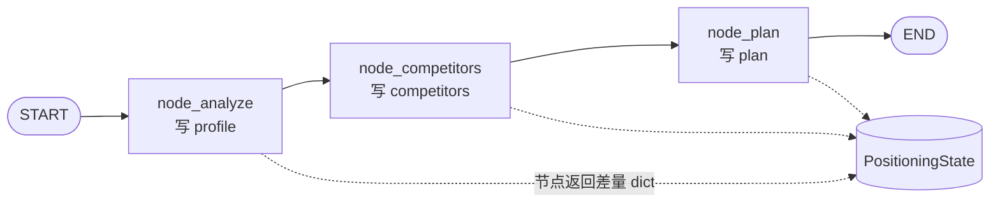

**知识点**：
- LangGraph 最小可用形态：一条直线 `START → analyze → competitors → plan → END`
- 节点返回的是**差量 dict**（`{"profile": ...}`），不是完整 state
- 节点间通过 prompt 传递上游产出（`plan` 的 prompt 里同时有 profile 和 competitors）
- 创作类任务用高温度（0.7）

### 🔥 2. 热点监控

**目标**：抓热点 → AI 筛选 → 生成选题建议。

**链路**：`并行抓 5 平台 → 合并去重 → LLM 筛选 → 选题建议`

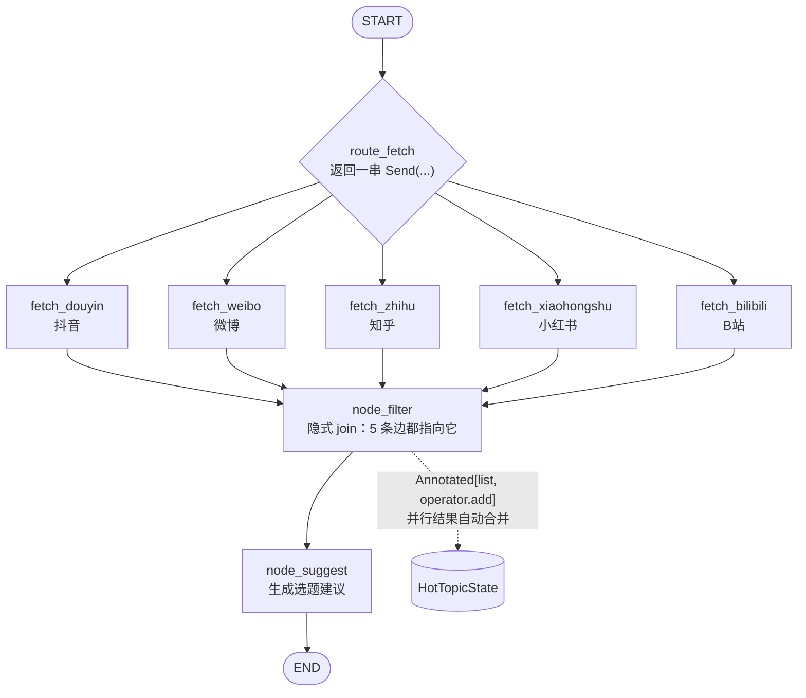

**知识点**：
- LangGraph 的 **`Send` 并行**机制：`add_conditional_edges(START, route_fetch, [...])`
- `Annotated[list, operator.add]` 让并行节点的结果**自动合并**
- 多平台抓取要加请求间隔 + 随机抖动，降低触发公共 API 限流的概率
- ⚠️ NewsNow 公共 API **不返回真实热度值**，`_estimate_heat()` 是按排名估算的，
  只用于排序展示，不能当真实数据写进分析结论

**数据源**：TrendRadar / NewsNow 聚合 API（公共接口，无需密钥，可自部署 `ourongxing/newsnow`）

### 📝 3. 内容复刻

**目标**：爆款链接 → 提取文案 → 拆解爆款公式 → 仿写新文案 + 5 类标题。

**链路**：`下载视频 → ASR 提文案 → 拆解（5 维度）→ 仿写 → 生成标题`

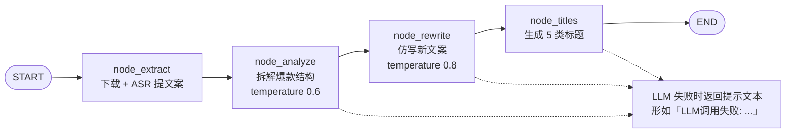

> ⚠️ 失败提示文本**必须被当成"不可用"**：`_is_usable()` 会把
> 「LLM调用失败 / LLM未配置」这两类前缀判为无效产出。
> 曾经漏了这一判据，失败串被当作模型输出继续往下传，后面几步全白跑。

**知识点**：
- `extract_url()` 从抖音/小红书的分享口令混合文本里提取纯 URL
- yt-dlp 用 **Python API**（不用 subprocess）：不依赖 PATH 里的可执行文件，
  也绕开 Windows 上 ffmpeg 合并音视频的管道/编码坑
- 视频 → 音频（ffmpeg）→ 文本（百炼 ASR）
- LLM 分析链路：钩子类型 / 结构模板 / 情绪节奏 / 金句亮点 / 互动引导
- 五种标题类型：数字型 / 疑问型 / 痛点型 / 悬念型 / 命令型

### 🎥 4. 口播视频

**目标**：台词 → 提词器滚动读稿 / 数字人出镜 → 视频。

**双模式**：
- 📺 **提词器**：纯前端 HTML/JS 大字滚动（每次 3 行，1~15 秒/行可调），**不调任何模型**
- 🎭 **数字人**：克隆音色 → TTS 配音 → 对口型 → MP4

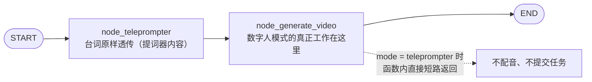

> 图是**严格线性**的：`mode` 的分流发生在 `node_generate_video` **函数内部**，
> 不是条件边。提词器模式也要走完两个节点，只是第二个节点什么都不做 ——
> 这样页面拿到的 state 键始终完整，不用到处判空。

**配音路由**（本项目自定义的语义，课案里没有「内置音色」这条用户可见的路）：

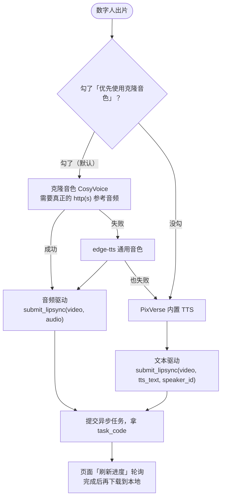

> ⚠️ **模特视频要在跑 TTS 之前就校验存在性**：课案的顺序是先配音后检查，
> 路径失效时会白白消耗一次合成额度。本项目补回了存在性判断。

**知识点**：
- **素材必须先换成可访问的资源 URL**：数字人走百炼临时存储（`tools/dashscope_upload.py` → `oss://`，48 小时有效），**不需要自建公网托管**；只有声音克隆的 `create_voice` 才要真正的 http(s)（走 `tools/asset_host.py`）
- **音色缓存**：CosyVoice 创建音色有**配额**，同一个源音频必须复用 voice_id
  （按 路径+大小+修改时间 做指纹，落 `.cache/voices.json`）
- **异步任务交互**：提交拿 `task_id` → 页面点「刷新进度」轮询 → 完成后自动下载到本地。
  在 Streamlit 里**不能阻塞等待**（会把界面卡死）
- PixVerse 两种驱动：**音频驱动**（用克隆音色）/ **TTS 文本驱动**（用平台内置音色，一步出片）
- **配音路由**（由页面「优先使用克隆音色」勾选框决定，见 `workflows/video.py` 的 `node_generate_video`）：
  - **勾选**（默认）→ 克隆音色 → 失败降级 edge-tts 通用音色 → 两者都失败才回退 PixVerse 内置 TTS；
  - **不勾** → 跳过克隆与 edge-tts，直接用页面选好的 PixVerse 内置音色（`speaker_id`）一步出片

### 🎬 5. 视频剪辑

**目标**：口播视频后期 —— 自动转录、加字幕、加动画素材、配 BGM、渲染。

**核心思路（课案原有）**：**不手写剪辑步骤**，把剪辑知识编码成 `.skills/video-use/SKILL.md`，
让 DeepAgent 自己按手册调用 moviepy 完成。

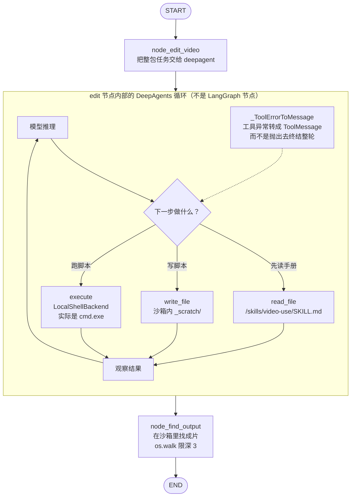

> 循环的**上限**由 LangGraph 的 `recursion_limit` 管（本项目 150）。
> 课案没设上限；从 50 提到 150 是因为一次超时命令的降级重试就要吃掉十几个 super-step。

**知识点**：
- **DeepAgents 技能机制**：`create_deep_agent(skills=[技能父目录])`，
  启动时只读 `name` + `description`，匹配到才 `read_file` 拉正文（渐进式披露，省 token）
- ⚠️ **`skills=` 的路径必须相对 backend 的 `root_dir`** —— 传**绝对路径**是「第一次真跑就崩」的硬约束：
  `SkillsMiddleware` 拿它去 `backend.ls()`，被 `virtual_mode` 判为沙箱外，直接抛
  `ValueError: Path ... outside root directory`，agent 一步都没执行。
  本项目实际写法是 `CompositeBackend(default=沙箱, routes={"/skills/": FilesystemBackend(...)})`
  + `skills=list(routes)`（见 `workflows/mashup.py` 文件头第 9 条、VERIFY_REPORT 5.9①）
- **`LocalShellBackend`**：`FilesystemBackend + execute`，agent 能在沙箱里真的跑 `python script.py`
- **沙箱路径规则**：所有输出必须用 `os.path.join(os.environ['WORK_DIR'], ...)`，
  禁止手写盘符路径
- moviepy 2.x 的 API 变化（见下）
- **中文渲染**：`TextClip` 的 `font` **必须给字体文件路径**
  （`C:/Windows/Fonts/msyh.ttc`）；写字族名 `'Microsoft YaHei'` 本机直接报
  `ValueError: Invalid font`（moviepy 2.x 把 font 当文件加载，不做族名解析）。
  走 HyperFrames 时 HTML 必须带中文字体 `<style>`，否则全是方框

**⚠️ 课案的剪辑约束是踩出来的，一条都不能松**：
| 约束 | 不遵守的后果 |
|---|---|
| 字幕只能用 `SubtitlesClip` 加载 SRT，禁 `for` 循环 + `TextClip` | 字幕重复 |
| 必须传 `make_textclip` + `with_position` | 字幕被定位到合成帧底部（素材区），下半截被裁 |
| 禁 `.with_mask()` / `.set_mask()` / `.to_mask()` | 隐式蒙版 |
| `CompositeVideoClip` 的 `size` 必须是 `(w, h + h//3)` | 写 `(w, h)` 会裁掉素材层和字幕下半截 |
| 视频 clip 不要 `.resized((w, h))` | 隐式蒙版 |

**本仓库实测补的四条**（课案没有，不加会翻车；对应 `workflows/mashup.py` 文件头 docstring 的第 7~10 条）：
1. **把 `.venv\Scripts` 顶到子进程 PATH 最前面** ——
   本机 PATH 里的 `python` 是 Windows Store 占位符，**执行后静默无输出**。
2. **system_prompt 里必须说明 `execute` 跑的是 `cmd.exe` 不是 bash** ——
   不写，模型会反复敲 `ls`/`pwd`/`cat`，实测一路撞到 `GraphRecursionError`。
3. **技能目录必须经 `CompositeBackend` 挂到虚拟路径** ——
   传绝对路径实测第一次真跑就抛 `ValueError: Path ... outside root directory`（见上）。
4. **Windows 上 `capture_output=True` 不能走管道** ——
   管道句柄被整棵子进程树继承，`timeout=` 会整体失效（实测 `execute(timeout=8)` 301.8 秒才返回）。

同属本仓库实测补充的还有 **`_ToolErrorToMessage` 工具异常中间件**（`workflows/mashup.py`）：
把工具异常转成回给模型的 `ToolMessage(status="error")`，而不是直接抛出去终结整轮任务 ——
不加，一次沙箱越界读取就会让 20+ 步的工作当场作废（见 VERIFY_REPORT 5.9③a）。

**moviepy 2.x 的坑**：
```python
# ⚠️ SubtitlesClip 不在顶层，必须从子模块导入
from moviepy.video.tools.subtitles import SubtitlesClip
# ⚠️ TextClip 用 font= / font_size=（2.x 没有 fontsize=）
# ⚠️ font 必须是**字体文件路径**：'C:/Windows/Fonts/msyh.ttc'
#    写成 'Microsoft YaHei' 会报 ValueError: Invalid font（本机实测）
```

### 📊 6. 数据复盘

**目标**：抖音真实作品数据 → 漏斗诊断 / 内容评估 / 优化策略。

**链路**：`采集作品数据 → 流量漏斗诊断 → 内容质量评估 → 优化策略生成`

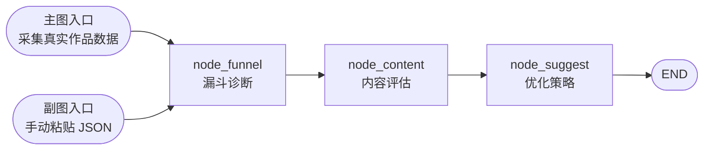

> 两个入口**汇进同一条尾巴** —— `node_funnel` / `node_content` / `node_suggest`
> 在两个图里是同一批函数，所以粘贴一份 JSON 也能跑出同一套诊断。
> 降级入口不是"另写一条简化链路"，而是把采集那一环换掉。

**知识点**：
- 四个 LLM 节点串行，每个都用真实数据喂 prompt
- 漏斗转化率计算（播放→点赞→评论→分享→收藏）
- **Cookie 获取**：通过 CDP 从 Edge 浏览器直接读（绕开 v20 加密和文件锁），
  比硬解加密库可靠
- **降级入口**：采集服务不可达时，可以手动粘贴作品数据 JSON 走同一套诊断链路

**⚠️ 课案的爬虫依赖已经失效**：课案用的是本地项目 `erma0/douyin`，
但该仓库**已因合规审查于 2026 年 6 月被清空**（只剩 README）。
本项目改用自托管的 [Evil0ctal/Douyin_TikTok_Download_API](https://github.com/Evil0ctal/Douyin_TikTok_Download_API)：

```powershell
# 用项目自带的 compose 定义（推荐）
cd Media_Agent\deploy
docker compose -f douyin-api.compose.yml up -d
Invoke-WebRequest http://127.0.0.1:8080/docs -UseBasicParsing   # 起来后应返回 200
```

> ⚠️ **别用镜像默认的启动命令**（`docker run ... evil0ctal/douyin_tiktok_download_api:V4.1.2`）。
> 它内部跑 `uvicorn.run(..., reload=True)`，实测在本机 Docker Desktop 上**服务起不来**：
> 容器状态是 running、但容器内 80 端口始终没有监听，`docker logs` 只有 DNS 报错，
> 前台跑 60 秒 stdout 一个字都不输出。compose 里显式关掉了 `reload`，45 秒内正常启动。

**Cookie 怎么配**（采集本人主页数据必需）：

1. 浏览器登录 <https://www.douyin.com>；
2. `F12` → **Network** → 刷新页面 → 点任意一条发往 `douyin.com` 的请求；
3. **Headers → Request Headers** → 复制整条 `Cookie:` 的值；
4. 粘到根 `.env` 的 `MEDIA_DOUYIN_COOKIE=` 等号后面（**整行、不要加引号**）。

`.env` 在 `.gitignore` 里、不会入库。也支持在页面上临时粘贴（只作用于当前会话，
重启即失效，不会留下忘记清理的持久凭据）。

> ⚠️ **已知上游缺陷（2026-09 实测）**：即使 Cookie 正确，
> v4 镜像的 `fetch_user_post_videos`（抖音 `aweme/post`）也会被固定回 **403** ——
> 该端点的请求签名 `a_bogus` 算法停在 2025-03，跟不上平台后续改动；
> 上游 README 亦写明 *v4 has no identity pool*（v5 才有自维护身份池）。
>
> 判据（三条都实测过）：同一个容器里 `handler_user_profile` 能正常返回 200；
> 换成任意公开大号请求同一端点同样 403；宿主机与容器出口 IP 完全一致。
> 所以**不是 Cookie 过期、也不是账号被风控**。
>
> 此时请用页面的「📋 手动粘贴作品数据」降级入口 —— 后面的漏斗诊断 / 内容评估 /
> 优化策略完全一样。要真正打通自动采集需要迁移到 **v5.1**（4 个容器，其中
> `browser-rpc` 与 `downloader` 需从源码构建），详见 `VERIFY_REPORT.md` 第 8 节第 4 条。

---

## 配置项清单（全部在根 .env）

复用根配置的（**不要重复配**）：`API_KEY` / `BASE_URL` / `MODEL_NAME` / `DASHSCOPE_API_KEY` / `DASHSCOPE_API_BASE` / `DASHSCOPE_WORKSPACE_ID`

Media_Agent 特有的：

| 键 | 默认 | 说明 |
|---|---|---|
| `MEDIA_LLM_MODEL` | 空 | 留空 = 复用根 `MODEL_NAME` |
| `MEDIA_DEEPAGENT_MODEL` | 空 | 留空 = 复用 `MEDIA_LLM_MODEL` |
| `MEDIA_LLM_PROVIDER` | 空 | 模型路由：留空 = 复用根 `API_KEY` / `BASE_URL`；填 `deepseek` = 只让本子项目改用根 `.env` 的 `DEEPSEEK_*` 三项 |
| `MEDIA_ASR_MODEL` | `qwen-audio-3.0-asr-flash` | 语音识别模型（Fun-ASR 家族的云托管版） |
| `MEDIA_ASR_LANGUAGE` | `zh` | 语种提示 |
| `MEDIA_ASR_INLINE_MAX_BYTES` | `10485760`（10MB） | 音频转 Base64 内嵌的上限；超过则先上传百炼临时存储换 `oss://` |
| `MEDIA_TTS_ENABLED` | `true` | 关掉则完全不做配音 |
| `MEDIA_TTS_MODEL` | `cosyvoice-v2` | 声音复刻驱动模型（创建音色与合成必须一致） |
| `MEDIA_TTS_FALLBACK_VOICE` | `zh-CN-XiaoxiaoNeural` | edge-tts 兜底音色 |
| `MEDIA_VOICE_CACHE_FILE` | `.cache/voices.json` | 克隆音色缓存文件（CosyVoice 建音色有配额，必须复用，不能每次重建） |
| `MEDIA_AVATAR_MODEL` | `pixverse/pixverse-lipsync` | 数字人对口型模型 |
| `MEDIA_AVATAR_TIMEOUT` | `900` | 数字人异步任务最长等待秒数 |
| `MEDIA_ASSET_SSH` | 空 | 公网素材托管的 ssh 目标，形如 `ubuntu@1.2.3.4` |
| `MEDIA_ASSET_REMOTE_DIR` | `/var/www/media-assets` | 服务器上的静态目录 |
| `MEDIA_ASSET_BASE_URL` | 空 | 对外基址，形如 `http://1.2.3.4/media-assets` |
| `MEDIA_VOICE_REF_URL` | 空 | 已托管好的固定参考音频 URL（可选，优先于上面的托管） |
| `MEDIA_IMAGE_API_KEY` / `_BASE_URL` / `_MODEL` | 空 | 留空则图片生成降级为占位图 |
| `MEDIA_TRENDRADAR_API_URL` | NewsNow 公共 API | 可换自部署实例 |
| `MEDIA_DOUYIN_API_BASE` | `http://127.0.0.1:8080` | 自托管抖音采集服务 |
| `MEDIA_DOUYIN_COOKIE` | 空 | 采集本人主页数据需要 |
| `MEDIA_BGM_PATH` | 空 | 留空则不混音 |
| `MEDIA_MASHUP_USE_HYPERFRAMES` | `false` | 剪辑动画素材的生成方式：`false`=moviepy 直接画（本机默认）；`true`=课案原方案 HyperFrames。本机 `init`/`render` 会卡到 300s 超时，故默认关 |
| `MEDIA_VIDEO_OUTPUT_DIR` 等四个目录 | 注释掉 | 注释掉即用 `Media_Agent/.cache` 下的默认绝对路径 |

---

## 如何新增一个模块

照着现成的六个模块抄一遍就行，顺序是**自下而上**（先工具、再工作流、最后页面），
每层都有个「注册点」别漏：

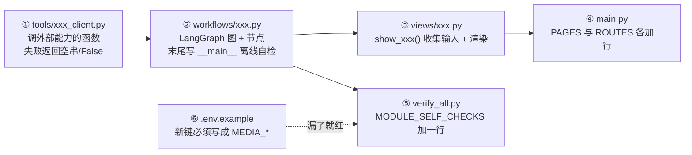

1. **`tools/xxx_client.py`** —— 一个文件包一个外部能力。约定：失败返回 `""` / `{"success": False}`
   并打印中文提示，**不抛异常**（上层靠返回值判断，不靠 try）。
2. **`workflows/xxx.py`** —— 建 `TypedDict` 状态 → 写节点函数（返回**差量 dict**）→ `add_node` / `add_edge`。
   末尾必须有 `if __name__ == "__main__":` 离线自检：**打桩**顶掉真实网络调用，零密钥也能跑绿。
3. **`views/xxx.py`** —— 只写 `show_xxx()`：收集输入 → 调 `run_xxx()` → 先存 `st.session_state` 再渲染。
   页面上不要出现 `llm_call()` 或任何 HTTP 调用。
4. **`main.py`** —— `PAGES` 与 `ROUTES` 两张表各加一行，侧边栏就有了。
5. **`verify_all.py`** —— 把新工作流文件登记进 `MODULE_SELF_CHECKS`，
   它才会进第 1 层自检（不登记 = 永远不校验）。
6. **`.env.example`** —— 新增的配置项必须写成 `MEDIA_<字段名大写>`。
   第 3 层的「文档键名契约」会拿模板里的键去反查 `MediaAgentSettings` 的字段，
   **对不上直接判红**（这类错误没有报错、只有静默失效，所以必须机器拦）。

改完跑一遍：

```powershell
& 'F:\ProGram\Python_Base\.venv\Scripts\python.exe' 'F:\ProGram\Python_Base\Media_Agent\verify_all.py'
```

---

## 常见问题

**Q：为什么一直提示「未配置密钥 / 已降级」？**
A：看首页的「运行环境」卡片，或者跑 `verify_all.py` 的第 3 层环境契约检查。
文本 LLM 复用根 `.env` 的 `API_KEY`，百炼相关用 `DASHSCOPE_API_KEY`。

**Q：百炼报地域错误？**
A：语音识别 / 声音复刻 / 视频对口型**只在华北2（北京）**提供，必须用该地域的 API Key。

**Q：PixVerse 报模型不存在？**
A：需要先在百炼控制台 → 模型市场 → 搜 **PixVerse** → 点「立即开通」。
如果专属域名不对，在 `.env` 里配 `DASHSCOPE_WORKSPACE_ID`。

**Q：数字人任务一直 PENDING？**
A：官方说生成要 1~5 分钟，且**并发任务数为 1**。点页面上的「刷新进度」按钮轮询即可。

**Q：剪辑 agent 反复失败 / 卡住？**
A：看「工具调用轨迹」。最常见的是模型在用 bash 命令（`ls`/`cat`），
但 `execute` 跑的是 cmd.exe —— 检查 `workflows/mashup.py` 的 system_prompt 是否完整。

**Q：HyperFrames 装不上 / 渲染卡住？**
A：本机实测就是这个情况：CLI 能装（`npx --yes hyperframes --version` → `0.8.46`），
但 `init`/`render` 会一直卡到 300 秒超时（它要 puppeteer 下载浏览器，本机拉不下来）。
`MEDIA_MASHUP_USE_HYPERFRAMES` 默认 `false`，agent 直接用 moviepy 画动画素材 ——
这正是 SKILL.md 里的降级分支，不影响出片。
浏览器链路正常的机器上把它设成 `true` 即可恢复课案原方案。

**Q：`python` 命令没有任何输出？**
A：PATH 里的 `python` 是 Windows Store 占位符。用
`F:\ProGram\Python_Base\.venv\Scripts\python.exe` 的完整路径。

---

## 相关文档

- `docs/课案解读与外部API替代调研.md` —— 课案完整解读 + 外部 API 替代可行性调研（含接口字段映射）
- `docs/课案全文提取.txt` —— 课案原文（去 CSS 噪音）
- `docs/课案代码块提取.txt` —— 课案全部代码块
- `VERIFY_REPORT.md` —— 实测记录
