# RAG 财务票据智能问答系统

> 课案来源：`G:\笔记\LLM\课件导出\RAG 基础篇.html`、`G:\笔记\LLM\课件导出\RAG 优化篇.html`
> 本项目 = 基础篇（票据 RAG 全链路）+ 优化篇（Agentic RAG / Text-to-SQL / GraphRAG / Langfuse 评估闭环）
> **所有模型一律调用外部 API**（不部署本地模型）。当前模型栈（2026-09-17 起）：
> LLM = `deepseek-flash`（DeepSeek 官方 `api.deepseek.com`）、
> Embedding = `BAAI/bge-m3`、Reranker = `BAAI/bge-reranker-v2-m3`（后两者走 SiliconFlow）、
> OCR 走 PaddleOCR 云服务。
>
> 中途试过 `grok-4.6`（私有网关）并完整验证通过，但它的延迟抖动太大（同一请求实测 5.6s / 6.5s / 131.9s，
> 端到端单题均值 46s、流式出现过 378s 才吐第一个 token），且负载下会直接断连，最终换回 DeepSeek 官方
> （实测单题均值 **2.69s**，质量指标与 grok 完全一致）。换回时发现并修掉一个真缺陷：`deepseek-flash`
> 是思考模型，给路由的 `max_tokens=64` 会被思考吃光、正文恒为空 → 路由静默退化，详见 8.x。
> ⚠️ 第二轮真机复跑又推翻了一版修法：`enable_thinking: False` 被这个端点静默忽略，
> 真正生效的是 `thinking: {"type": "disabled"}`（同样见 8.x 那一行）。

---

## 零、怎么读这份文档（先看这里）

这份 README 是**唯一入口**：从"跑起来"到"改代码"到"踩过的坑"全在里面，别只翻第一节。
下面按**目的**给三条路线，按顺序读即可；目录按重要度分四级见 [3.1 目录作用分级](#31-目录作用分级按重要度四级)。

### 0.1 三条阅读路线

**路线 A：我只想把它跑起来（约 15 分钟）**

| 顺序 | 读哪节 | 你要拿到什么 |
|---|---|---|
| A1 | 二 快速开始 | 起服务的命令、数据准备顺序、启动应用、跑测试 |
| A2 | 六 配置项速查 | `.env` 里哪些是必须配对才不报 400 的（模型名/网关/阈值） |
| A3 | 八 已知差异与坑 | 本机特有的坑（沙箱跑测试、PG 握手、缓存分层……） |

**路线 B：我要读懂 RAG 这条链路（约 1 小时）**

| 顺序 | 读哪节 | 你要拿到什么 |
|---|---|---|
| B1 | 一 这个项目是什么 + 四 架构图 | 全局数据流：图片怎么变成答案 |
| B2 | 三 目录结构（3.1 分级 → 3.2 全树） | 每个目录装什么，先读哪几个文件 |
| B3 | 代码：`pipeline/rag_pipeline.py` → `pipeline/filters.py` → `retrieval/*` | 主链路的四段：缓存/路由/召回/重排 |
| B4 | **4.10 四条 RAG 线路 + 4.11 融合架构全景** | 基础/Agentic/GraphRAG/融合四条线各是什么、前端怎么选、融合架构里三条线路的长处分别落在哪一层 |
| B5 | 五 与课案的对齐情况 | 哪一块对应课案哪一章、哪些是有意差异 |
| B6 | 六 阈值怎么重新标定（6.1） | 两个阈值从哪来、为什么是这个值 |

**路线 C：我要改代码 / 加功能（约 2 小时）**

| 顺序 | 读哪节 | 你要拿到什么 |
|---|---|---|
| C1 | 路线 B 全部 | 先有全局，再动手 |
| C2 | 六 6.2 换模型要重算哪些东西 | **换模型 = 重算向量 + 重标阈值**，清单化 |
| C3 | 七 测试与验证 | 测试怎么分层（离线 / integration / live）、怎么跑 |
| C4 | 八 8.3 尚未处理的欠账 | 已知问题清单，别重复踩 |
| C5 | 九 相关文档 | 连接信息、配置入口、姊妹项目 |

### 0.2 一句话版本（30 秒）

```
票据图片 ──OCR(PaddleOCR 云)──► Markdown ──build_ocr_json──► JSON ──tick_extract──► Milvus(300 条, 1024 维)
用户问题 ──缓存(FAQ/精确)──► 路由 ──改写 ──过滤+双路召回 ──重排(阈值 0.22)──► LLM(deepseek-flash)──► 带来源的回答
                                    └─ 进阶：Agentic(DeepAgent) / Text-to-SQL(PG) / GraphRAG(Neo4j) / Langfuse 评估
```

**读完这份 README，你应该能回答：** 一条数据从图片到答案经过哪些环节、每个环节的代码在哪、
哪些参数是"随模型走"的（阈值、维度）、以及哪些地方是刻意与课案不同。

### 0.3 常见任务 → 直接去哪

| 我要做的事 | 去哪 | 命令 / 位置 |
|---|---|---|
| 把整个系统跑起来 | 二 快速开始 | `powershell -File F:\DockerDesktopData\start-dbs.ps1` → `uv run python RAG/app/main.py` |
| 跑一遍测试 | 七 | `uv run pytest RAG -q`（离线）/ `-m integration`（真服务） |
| 看某条链路为什么答错 | §四 架构图 → `data/stage_eval_records.jsonl` | 每条样本都记了路由/筛选/候选/重排/回答，逐阶段定位 |
| 重新标定阈值 | 6.1 | `search_threshold.py`（FAQ 相似度）/ `calibrate_rerank.py`（重排相关度） |
| 换 LLM / Embedding / Reranker | 6.2 | **换 embedding 或 reranker 必须重算三处向量 + 重标两个阈值** |
| 改提示词 | `core/prompts.py` | 改完跑 `run_stage_eval.py` 看路由准确率有没有退化 |
| 加数据（新票据） | 二 步骤 ①~⑦ | OCR → JSON → 抽字段 → 向量 → （可选）PG / Neo4j |
| 看生产版 Agent 的审批怎么走 | 5.2 安全保障 | `uv run python RAG/script/hitl_demo.py` |
| 看一次真实的实验对比 | 5.3 | `uv run python RAG/script/langfuse_evaluation.py --run-name <名字>` |
| 出问题了先查什么 | 八 | 8.1 环境类（沙箱/服务）/ 8.2 数据口径类 / 8.3 已知欠账 |

---

## 一、这个项目是什么

一个面向**财务票据**（登机牌 / 发票 / 火车票）的检索增强问答系统，覆盖从图片到答案的完整链路：

```
票据图片 → OCR → OCR 清洗 → 字段抽取(结构化) → 向量化 → Milvus
用户问题 → 缓存/FAQ → 路由 → query 改写 → 过滤 + 双路召回 → 重排 → 阈值门控 → LLM 生成
```

在此之上，对齐优化篇补齐了四条进阶能力：

| 能力 | 落地位置 | 解决什么问题 |
|---|---|---|
| Agentic RAG | `agentic/finance_agent.py` | 把"选策略、检索、核验证据"交给 DeepAgent 自主编排，证据不足时只许再检索一轮 |
| Text-to-SQL | `agentic/text_to_sql.py` | 金额汇总、按人员/日期精确筛选这类问题走结构化查询，不让模型做算术 |
| GraphRAG | `graph_rag/` | 多实体关联问题（谁审批谁、哪几笔属于同一次出差）用实体-关系图 + 社区摘要回答 |
| 评估闭环 | `evaluation/` + `script/` | 分阶段指标 + RAGAS 四指标 + Langfuse 实验对比，优化不再靠感觉 |

### 1.1 技术栈与规模（一眼看全）

| 维度 | 现状 |
|---|---|
| 语言 / 运行环境 | Python 3.12，依赖用 `uv` 管理（`pyproject.toml` + `uv.lock`），入口 `F:\ProGram\Python_Base\.venv` |
| Web | FastAPI（`/api/chat`、`/api/chat/stream`）+ Chainlit 界面（进程内挂载） |
| Agent 框架 | LangChain 1.4 / LangGraph / DeepAgents 0.7（Agentic 部分）；`langchain.agents.middleware` 提供上下文/重试/审批中间件 |
| 模型（全外部 API） | LLM `deepseek-flash`（DeepSeek 官方）、Embedding `BAAI/bge-m3`（1024 维，SiliconFlow）、Reranker `BAAI/bge-reranker-v2-m3`（SiliconFlow）、OCR `PaddleOCR-VL-1.6`（云） |
| 存储 | Milvus（票据向量，`tick` 集合 1024 维 COSINE）、Redis（两层缓存）、PostgreSQL（结构化票据，供 Text-to-SQL）、Neo4j（知识图谱） |
| 可观测 | Langfuse 自部署（`:3001`）：生产链路 Trace + 离线实验对比 |
| 数据规模 | 票据 300 条（登机牌/发票/火车票各 100）、评估集 36 条、FAQ 标准问法 5 条 + 明细问答 60 条、图谱 51 实体 / 66 关系 / 6 社区（3 条票据的冒烟规模） |
| 代码规模 | **92 个 Python 文件 / 16238 行**（含 2026-09-17 补的约 5000 行中文注释，测试约 5.0k 行）；**607 个离线用例 + 14 个集成用例** |
| 测试策略 | 离线用例默认全跑（外部依赖全 monkeypatch）；`@pytest.mark.integration` 打真服务；真实 API 验证走 `script/` 手工留证 |

### 1.2 这个项目**不是**什么（避免误期待）

- **不是生产系统**：没有鉴权、限流、多租户隔离（课案明确说这些属于 API 网关/服务层职责）。
- **不训练模型**：优化篇的"微调"章不实现，只保留方法论与难负例挖掘思想。
- **不做本地部署**：vLLM/SGLang/AutoDL 那一大段与我们无关，全部走外部 API；代价是票据图片会离开本机（与课案的数据安全前提相反）。
- **向量不在 PG**：课案用 pgvector 存 `ticket_chunks`，本项目向量仍在 Milvus，PG 只承担结构化查询。

---

## 二、快速开始

### 2.1 配置（唯一配置入口在仓库根目录）

| 文件 | 作用 |
|---|---|
| `F:\ProGram\Python_Base\.env` | 全部密钥与连接参数（不入 Git） |
| `F:\ProGram\Python_Base\config.py` | 统一读取入口，所有代码 `from config import settings` |

本项目**不建自己的 conf.py**，也不在业务代码里散落 `os.environ`。

### 2.2 启动依赖服务

```powershell
# 一次性拉起:MySQL/PostgreSQL/Redis/Milvus/Neo4j + Langfuse 全套
powershell -File F:\DockerDesktopData\start-dbs.ps1

# 停止
powershell -File F:\DockerDesktopData\stop-dbs.ps1
```

连接信息（含账号口令、端口、数据目录）统一记录在 **`F:\DockerDesktopData\数据库连接信息.md`**。

### 2.3 数据准备（首次或数据更新时）

```powershell
cd F:\ProGram\Python_Base

# ① 票据图片 OCR(输出 data/output/<分类>/*.md)
uv run python RAG/data_process/paddle_ocr.py

# ② Markdown 汇总成入库 JSON(data/ocr_results.json + ocr_results_clean.json)
uv run python RAG/data_process/build_ocr_json.py --dedupe consecutive

# ③ 抽取字段并写入 Milvus tick 集合(一票一记录)
uv run python RAG/data_process/tick_extract.py --insert --recreate

# ④ 生成检索向量并回填
uv run python RAG/data_process/embed_tickets.py

# ⑤ 预设问答分两层写入 Redis(标准问法进相似度层,明细问答只进精确层)
uv run python RAG/data_process/seed_qa_cache.py --force

# ⑥ 票据结构化字段导入 PostgreSQL(Text-to-SQL 用)
uv run python RAG/script/import_tickets_to_pg.py

# ⑦ GraphRAG 建图(实体/关系/社区摘要)
uv run python RAG/script/build_finance_graph.py
```

### 2.4 启动应用

```powershell
uv run python RAG/app/main.py
# Chainlit 界面 + FastAPI: http://127.0.0.1:8099
#   POST /api/chat         非流式问答
#   POST /api/chat/stream  SSE 流式问答
```

### 2.5 跑测试

```powershell
uv run pytest RAG -q                  # 全部离线用例(默认不依赖服务与 API)
uv run pytest RAG -m live -q          # 需要真实外部 API 的用例
uv run pytest RAG -m integration -q   # 需要本地服务(Milvus/Redis/PG/Neo4j)的用例
```

---

## 三、目录结构（每个文件夹装什么）

### 3.1 目录作用分级（按重要度四级）

读代码不用平铺直叙地读。下面按"**不读它会怎样**"排序：L1 决定这个项目能不能跑对，
L2 是课案要求的进阶能力，L3 是数据与工具（改了才需要读），L4 是工程与验证（出问题才翻）。

| 级别 | 目录 / 文件 | 一句话作用 | 不读的后果 | 行数 |
|---|---|---|---|---|
| **L1 主链路**（必读） | `pipeline/rag_pipeline.py` | 事件化主流程：缓存→路由→改写→过滤+双路召回→重排→阈值门控→生成 | 看不懂"为什么这题没答对"，也定位不到阶段指标 | ~790 |
| L1 | `pipeline/filters.py` | 从问题抽票据条件 → Milvus 标量过滤表达式（另有 BM25 侧同语义过滤） | 不理解"零命中回退"与 route 语言不一致的坑 | ~510 |
| L1 | `retrieval/`（5 个文件） | 向量召回 / BM25 召回 / 重排 / 向量化 / 语料缓存 | 换模型时不知道要重算哪些向量、阈值为什么变 | ~480 |
| L1 | `core/cache.py` | 两层缓存：精确层 + FAQ 相似度层（按 `layer` 分层） | 可能把明细问答塞进相似度层 → 答成别人的票 | ~410 |
| L1 | `core/prompts.py` + `llm/chat.py` | 全部提示词 + 路由/改写/流式生成 | 换了模型却不知道为什么路由退化成默认值 | ~700 |
| **L2 进阶能力**（课案优化篇） | `agentic/finance_agent.py` | DeepAgent 组装：检索工具、证据分析子代理、上下文/重试/审批中间件、Langfuse 追踪 | 无法解释"生产版 Agent 为什么比主链路准" | ~834 |
| L2 | `agentic/text_to_sql.py` | 金额汇总/精确筛选走结构化查询（单条 SELECT + 黑名单 + 行数上限 + 五态返回） | 汇总类问题靠向量召回会漏票 | ~509 |
| L2 | `graph_rag/`（5 个文件） | 知识图谱：抽取→入图→Louvain 社区摘要→三种检索→FastAPI 接口 | 多实体关联问题答不好 | ~1573 |
| L2 | `evaluation/`（9 个文件） | 评估体系：样本构造、分阶段指标、排序指标、阈值标定、Ragas 评判 | 改完不知道是变好还是变差 | ~1610 |
| **L3 数据与工具**（要改数据才读） | `data_process/`（6 个文件） | 图片→OCR→Markdown→JSON→字段抽取→入库→向量回填；预设问答分层灌缓存 | 数据不可复现（换机就跑不出同一份索引） | ~1246 |
| L3 | `script/`（11 个文件） | 评估闭环、阈值标定、导入 PG、建图、HITL 演示、样本生成 | 不知道怎么重新标阈值 / 复跑实验 | ~2249 |
| L3 | `app/`（3 个文件） | FastAPI + Chainlit 前端 | 改了接口没人知道 | ~382 |
| L3 | `data/` | 票据图片、OCR 产物、评估集、阈值结果、图谱报告等**产物**（多数可重建） | —— | —— |
| **L4 工程与验证**（出问题才翻） | `tests/`（37 个文件） | 离线用例为主 + `@integration` 真服务用例；`service_probe.py` 是服务探针 | 改坏了不知道 | ~4970 |
| L4 | `pytest.ini` | 只影响 RAG 目录的测试配置（**注意 `norecursedirs` 会覆盖默认值**） | 权限受限时收集报错 | ~40 |
| L4 | `core/redis_client.py`、`core/database.py`、`core/logger.py`、`core/milvus_init.py` | 客户端与日志的基础设施（超时/不重试/按天轮转） | 不理解为什么故障会快速降级 | ~250 |
| L4 | `logs/`、`测试问题.txt` | 运行日志、人工整理的测试问题清单 | —— | —— |

> 全仓规模：**92 个 Python 文件 / 16238 行**（其中源码约 11.3k、测试约 5.0k）。行数含中文注释——
> 2026-09-17 的补注释工作往核心模块加了约 **5000 行**中文注释，所以本表数字比"代码行数"大。

> 每个模块的文件级说明见下一节 3.2；**代码里每个模块开头都有中文 docstring**（职责 / 课案出处 / 在链路中的位置 / 易踩的坑），
> 逐文件精读时先看那一段，能省掉大量来回。

### 3.2 完整目录树

```
RAG/
├── app/                     应用层:FastAPI + Chainlit 前端
│   ├── main.py              服务入口(挂载 Chainlit + 两个问答接口)
│   └── chat_ui.py           Chainlit 页面:把 RAG 每一步渲染成可视化 Step
│
├── pipeline/                问答主流程(核心编排)
│   ├── rag_pipeline.py      事件化流水线:缓存→路由→改写→召回→重排→生成,逐步产出事件
│   └── filters.py           召回过滤:从问题抽票据条件 → Milvus 标量过滤表达式
│
├── retrieval/               检索层
│   ├── embedding.py         文本向量化(外部 Embedding API,1024 维)
│   ├── vector_retrieval.py  Milvus 稠密向量召回(支持 filter_expr 下推)
│   ├── keyword_retrieval.py BM25 关键词召回(jieba 分词,进程内语料缓存)
│   └── rerank.py            SiliconFlow Reranker 重排序 + 相关度阈值门控
│
├── llm/                     大模型调用
│   └── chat.py              路由 / query 改写 / 流式与非流式生成(OpenAI 兼容接口)
│
├── core/                    基础设施与提示词
│   ├── cache.py             两层缓存:精确问答缓存(Redis,短 TTL)+ 预设问答相似度缓存
│   ├── database.py          Milvus 客户端
│   ├── redis_client.py      Redis 客户端(超时+不重试,故障快速降级)
│   ├── logger.py            loguru 日志(控制台 INFO / 文件 DEBUG 按天轮转)
│   ├── prompts.py           全部提示词模板(含评估与样本生成提示词)
│   └── milvus_init.py       一次性初始化:建库、建业务用户、授权
│
├── data_process/            数据准备(离线批处理)
│   ├── paddle_ocr.py        调 PaddleOCR 云 API 把票据图片转 Markdown(data/output/<分类>/)
│   ├── build_ocr_json.py    Markdown → ocr_results.json / ocr_results_clean.json
│   │                        (补齐"OCR → 入库"原本缺失的一环；清洗口径 --dedupe consecutive)
│   ├── tick_extract.py      三类票据字段抽取 + 写入 Milvus(一票一记录)
│   ├── embed_tickets.py     批量向量化回填 vec 字段
│   └── seed_qa_cache.py     预设问答写入 Redis
│
├── agentic/                 优化篇:Agentic RAG 与结构化查询
│   ├── finance_agent.py     DeepAgent 主流程 + 检索工具 + 证据分析子代理 + 生产中间件
│   └── text_to_sql.py       Text-to-SQL:票据表模型、SQL 生成、校验、执行、只读工具
│
├── graph_rag/               优化篇:GraphRAG
│   ├── models.py            Neo4j 节点与关系(Entity/Community/RELATES_TO + 向量索引)
│   ├── builder.py           建图:NER+关系抽取、社区检测(Louvain)、社区摘要、增量入库
│   ├── retriever.py         分层检索:社区摘要召回 → 社区内实体检索 → 多跳遍历
│   └── service.py           FastAPI 接口 /api/graph_rag/query
│
├── evaluation/              评估体系(纯逻辑,全部离线可测)
│   ├── eval_set.py          评估样本契约与 jsonl 读写
│   ├── eval_builders.py     从真实票据字段确定性构造四类场景样本
│   ├── stage_metrics.py     分阶段指标:路由/筛选字段/Recall@K/Hit@K/答案事实
│   ├── retrieval_metrics.py 排序指标:Recall@K、MRR、MAP、nDCG@K(与微调章同口径)
│   ├── threshold.py         阈值标定:相似度打分、按 F1 搜最优阈值、难负例挖掘
│   ├── run_recorder.py      把事件流落成评估 record
│   ├── sample_gen.py        样本生成质量审核解析(兼容 JSON 与文本两种输出)
│   └── llm_judge.py         按课案评分细则给最终回答打 1~5 分
│
├── script/                  可执行脚本(评估闭环 / 导入 / 建图 / 样本生成)
│   ├── build_eval_set.py          从 Milvus 确定性生成 data/eval_set.jsonl
│   ├── upload_langfuse_dataset.py 上传为 Langfuse 数据集(支持 --rebuild)
│   ├── langfuse_evaluation.py     Langfuse 实验:Recall@K + Ragas 四指标 + 批次聚合
│   ├── run_stage_eval.py          分阶段评估并输出报告
│   ├── build_threshold_dataset.py LLM 生成同义问法(FAQ 阈值标定的正例)
│   ├── search_threshold.py        标定 FAQ 相似度阈值 REDIS_SIM_THRESHOLD
│   ├── calibrate_rerank.py        用标注评估集标定重排阈值 RERANK_RELEVANCE_P
│   ├── hitl_demo.py               人工审批(暂停/恢复)真实冒烟
│   ├── generate_eval_samples.py   LLM 生成问答样本 + 双质检
│   ├── import_tickets_to_pg.py    Milvus → PostgreSQL 幂等导入
│   └── build_finance_graph.py     Milvus → Neo4j 一键建图
│
├── tests/                   测试(离线为主,真服务/真 API 用例单独标记)
├── data/                    数据与产物
│   ├── flight/ invoice/ train/   票据原始图片(100+100+100 张)
│   ├── output/                    OCR 结果 Markdown
│   ├── ocr_results_clean.json     清洗后的 OCR 汇总
│   ├── preset_qa.json             预问答对,按 `layer` 分层:5 条标准问法(相似度层)
│   │                              + 60 条明细问答(只进精确层,绝不参与相似度匹配)
│   ├── ocr_results_clean.json     入库用的 OCR 汇总(300 条,来自课案服务器的 DeepSeek-OCR-2)
│   ├── ocr_results_local*.json    本地 PaddleOCR 跑出的同一格式产物(11 条,抽样)
│   ├── finance_faq.json           课案 finance_faq.json 原文(标准问法)
│   └── *_test.json / *.jsonl      各阶段验证产物与评估集
├── logs/                    运行日志(按天)
├── pytest.ini               本目录测试配置(只影响 RAG)
└── 测试问题.txt              人工整理的测试问题清单(含边界与策略用例)
```

### 3.3 代码注释约定（新增 / 修改代码时照这个来）

项目里的注释**只解释"为什么"和"坑"**，不复述代码在做什么：

| 层级 | 写什么 | 例子（都在现有代码里） |
|---|---|---|
| 模块 docstring | 职责、课案出处、在链路中的位置、输入输出、**这个模块特有的坑** | `retrieval/embedding.py` 开头写了"`dimensions` 只有显式开启才下发，bge-m3 传了直接 400" |
| 函数 / 类 docstring | 参数与返回值语义、**为什么这么实现**、异常与降级行为 | `AnswerCache.lookup` 写明"Redis 异常时降级返回 None，继续走 RAG" |
| 行内注释 | 只标"看不出来但会影响结果"的地方：魔数来源、顺序依赖、必要的 workaround | `rag_pipeline.py` 里"route 条件先单独丢一次"的原因 |
| 不要写 | `# 遍历列表`、`# 返回结果`、把函数名翻译一遍 | —— |

另外两条硬约定：

1. **引用课案时写清章节**（别只写"按课案"）；有意的差异要写**为什么**（例如"课案用 pgvector，本项目留在 Milvus"）。
2. **每个非平凡模块留一个可跑的断言式自检**（`python <module>.py`）或在 `tests/` 有对应用例；
   两者都没有的（`data_process/tick_extract.py` 曾经就是）视为欠账，记在 §8.3。

---

## 四、架构图

一共 **11 张 mermaid 图**，都用**本项目自己的模块名与真实参数**画（不是课案图），按需跳读：

| 图 | 看它回答什么问题 |
|---|---|
| 4.1 总体架构 | 这个系统由哪几层组成、各层的模块叫什么 |
| 4.2 模型与外部服务 | 哪个环节调哪个外部服务（换模型/换网关时照这张排查） |
| 4.3 索引构建 | 一张票据图片怎么变成 Milvus 里的一行（离线链路，含新补的 `build_ocr_json.py`） |
| 4.4 问答主链路 | 一次提问经过哪些步骤、每步失败会怎样（时序图） |
| 4.5 检索细节 | 双路召回怎么合并、过滤零命中怎么三级回退、门控阈值是多少 |
| 4.6 Agentic RAG | DeepAgent 怎么自己选策略、怎么委派子代理核验证据 |
| 4.7 GraphRAG | 图谱怎么建（抽取→社区摘要）与怎么查（社区→实体→多跳） |
| 4.8 评估闭环 | 样本怎么来、指标怎么算、怎么用 Langfuse 按 run 对比 |
| **4.10 四条 RAG 线路** | 前端能选哪四条线、各条适合什么问、④ 的内部流程怎么走 |
| **4.11 融合架构全景** | 三条线路的长处分别进了哪一层、横切能力（缓存/多轮/降级）挂在哪 |
| 4.9 阶段输入输出表 | 排障用：每段的输入/输出/异常行为与代码位置（不是图，是表） |

> 图能不能画出来是**真渲染验证过**的，不是"写了就算"：`RAG/script/check_mermaid.py`
> 把本文件的 mermaid 块全抽出来生成一个校验页，用浏览器真渲染一遍 —— 最近一次结果
> **渲染成功 11/11 张**（mermaid 语法错在 Markdown 预览里往往只表现为"这块不显示"，
> 不真渲染很难发现；本项目实测踩过：标签里混 `**` 加粗会原样显示成星号、
> 标签里出现裸的 ASCII 双引号会把标签截断、子图连子图会把布局撑成一整块空白）。

### 4.1 总体架构

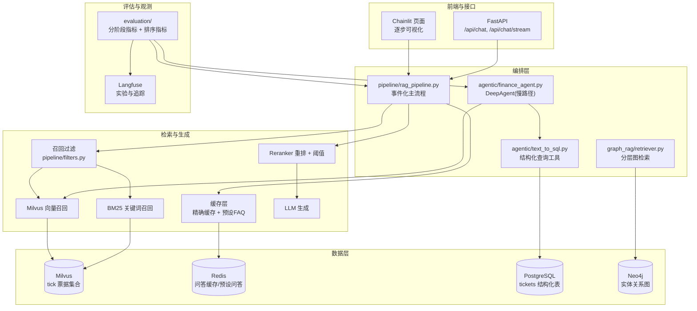

### 4.2 模型与外部服务（哪个环节调谁）

这张图回答"我们的框架到底依赖哪些外部服务、分别在哪个环节用"——换模型/换网关时按它排查：

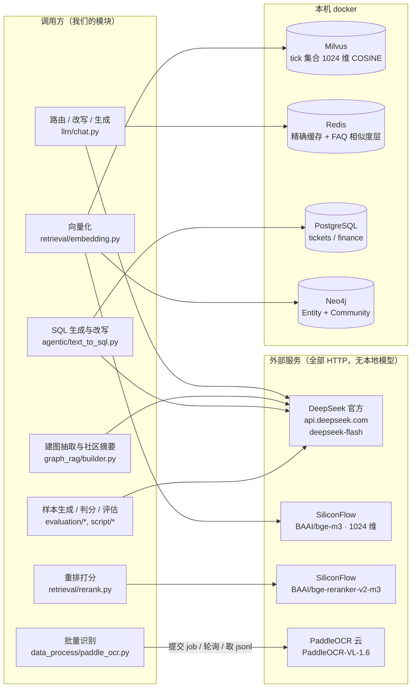

> 三条与"换模型"相关的硬约束（详见 6.2）：embedding 换了要重算 Milvus/Redis/Neo4j 三处向量；
> reranker 换了要重标 `RERANK_RELEVANCE_P`；LLM 换了要复跑分阶段评估看路由/筛选是否退化。
> 每处调用都必须带超时（`LLM_TIMEOUT` / `EMBEDDING_TIMEOUT`），否则上游挂住会把链路拖死。

### 4.3 索引构建（离线，一票一记录）

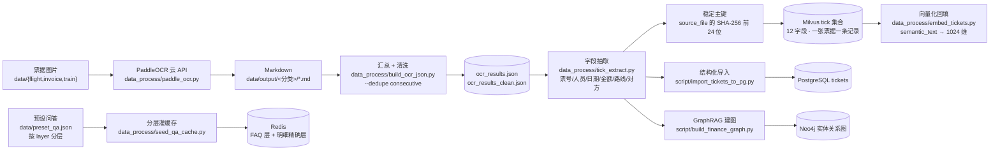

> 注意 MILVUS 那一步的顺序：**先写记录（vec 为空）再回填向量**，不是插入时就带向量。
> `build_ocr_json.py` 这一环原先缺失（`paddle_ocr.py` 只写 Markdown、`tick_extract.py` 只读 JSON），
> 2026-09-17 补齐，链路才可复现。

### 4.4 问答主链路（基础篇）

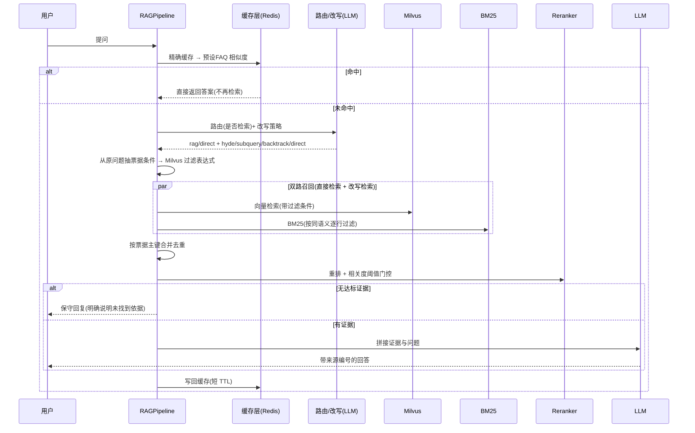

### 4.5 检索细节（双路召回 → 合并 → 重排门控）

上面那张是时序，这张画**数据怎么走、参数是多少**——RAG 检索出问题时照它对参数：

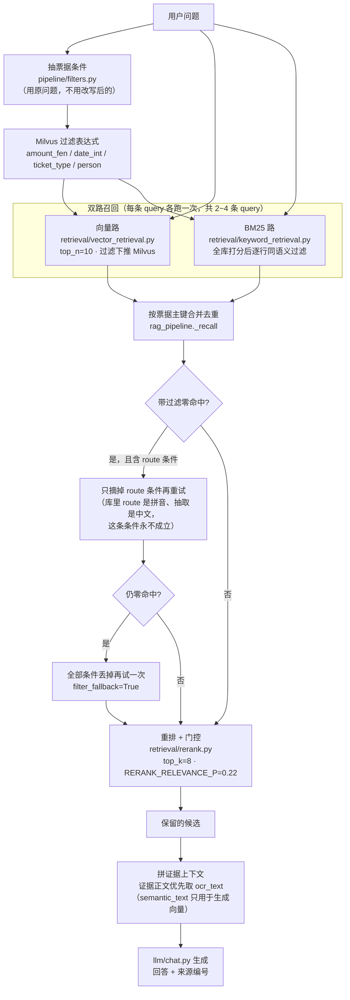

> 三个**随模型走**的参数（换模型必须重标/重算，见 §6.2）：`top_n=10`（检索条数）、
> `RERANK_RELEVANCE_P=0.22`（重排门控，跟着 reranker 的分数尺度）、`REDIS_SIM_THRESHOLD=0.79`（FAQ 相似度）。
> 另外 `filter_fallback=True` 的记录会透出到事件与评估报告——用它区分"库里真没资料"和"条件抽错了"。

### 4.6 Agentic RAG（优化篇）

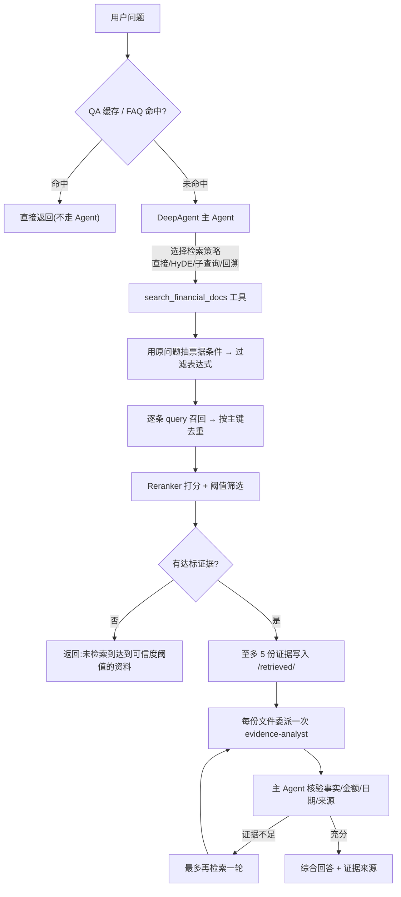

### 4.7 GraphRAG（优化篇）

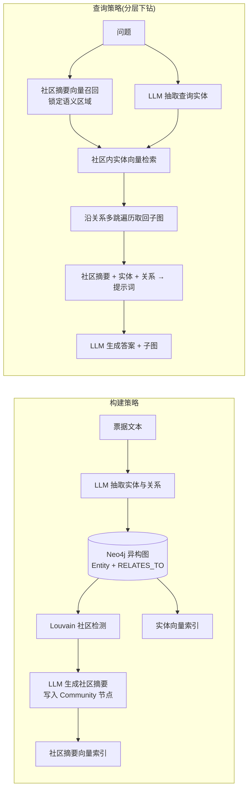

### 4.8 评估闭环（优化篇）

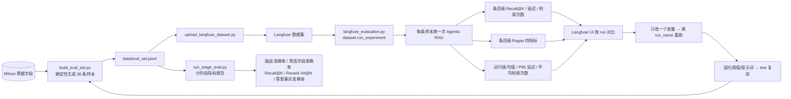

### 4.9 每个阶段的输入 / 输出 / 失败会怎样（排查用）

主链路的每一段都是"能降级就降级、不能降级就明说"，这张表是排障时的第一手依据：

| 阶段 | 输入 | 输出 | 失败/异常时的行为 | 代码位置 |
|---|---|---|---|---|
| 缓存查找 | 用户问题 | 命中答案 或 None | Redis 异常 → 记警告并继续走 RAG（**不阻断**） | `core/cache.py:lookup` |
| 路由 | 用户问题 | (是否需要 RAG, 改写策略) | LLM 调用失败或**正文为空** → 兜底成"走 RAG + 直接检索"并记 WARNING | `llm/chat.py:route_query` |
| 改写 | 问题 + 策略 | 改写后的 query 列表 | 失败 → 只保留原问题（`direct`） | `llm/chat.py:rewrite_query` |
| 条件抽取 | **原问题**（不是改写后的） | filters 字典 → Milvus 过滤表达式 | 抽取不到条件 → 不过滤；带条件零命中 → **先丢 route 再重试**，仍零命中才全部丢掉并置 `filter_fallback` | `pipeline/filters.py`、`rag_pipeline.py` |
| 双路召回 | query 列表 + 过滤表达式 | 去重后的候选（带 `vector_score` / BM25 分） | 单条 query 召回失败 → 记日志跳过该条，不影响其它路 | `pipeline/rag_pipeline.py:_recall` |
| 重排 + 门控 | 原问题 + 候选 | 分数 ≥ `RERANK_RELEVANCE_P`（0.22）的前 top_k 条 | 接口报错 → **显式抛出**（不能伪装成"没有资料"） | `retrieval/rerank.py` |
| 生成 | 问题 + 证据文本（**优先 `ocr_text`**） | 回答 + 来源 + 思考内容 | 无证据 → 走保守回复；LLM 异常 → 由上层记 `error` 字段 | `pipeline/rag_pipeline.py`、`llm/chat.py` |
| 阶段记录 | 事件流 + 样本 | 评估 record（路由/筛选/候选/重排/回答/耗时） | 单条失败也写进 records，供 `stage_eval_report.json` 汇总 | `evaluation/run_recorder.py` |

> 排查套路：先看 `data/stage_eval_records.jsonl` 里那条样本的 `actual_route` / `actual_filters` /
> `candidate_ids` / `reranked_ids` / `filter_fallback`，四步之内就能定位是"没路由对""条件抽错""召回没中"还是"被阈值挡了"。

### 4.10 四条 RAG 线路（前端可选 · 一条比一条复杂）

Chainlit 页面右上角 ⚙️ 设置里有 **RAG 线路** 选择器；HTTP 侧对应请求体的 `mode` 字段，
另外 `GET /api/modes` 会返回下面这张表（前端不要自己写死线路清单）。

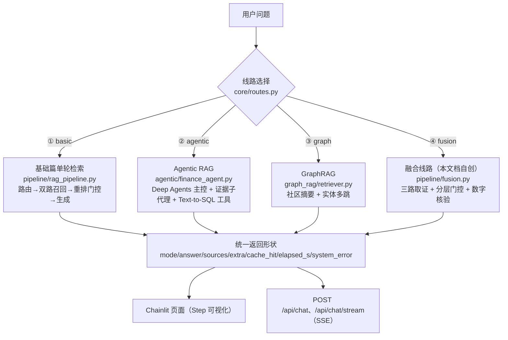

| 线路 | 课案出处 | 实现 | 多轮 | 真流式 | 缓存作用域 | 实测耗时* | 适合问什么 |
|---|---|---|---|---|---|---|---|
| ① `basic` 基础单轮检索 | 基础篇全篇 | `pipeline/rag_pipeline.py` | ❌ | ✅ | `""`（与改造前同一批键） | 6.0s | 单人单票的事实型问题（票号/日期/金额） |
| ② `agentic` Agentic RAG | 优化篇 | `agentic/finance_agent.py` | ✅ | ❌ | `agentic` | 22.0~38.5s | 需要自己定检索式、要精确聚合、要逐份核验的问题 |
| ③ `graph` GraphRAG | 优化篇（图谱部分） | `graph_rag/retriever.py` | ❌ | ❌ | `graph` | 4.5s | 关系型问题（"谁和谁有关系""某航班的行程"） |
| ④ `fusion` 融合线路 | **本项目自创编排**（不是课案内容） | `pipeline/fusion.py` | ✅ | ❌ | `fusion` | 6.0~23.7s | 一条问题里既有事实又有统计、还想要全局视角时 |

\* 实测耗时取自本机真机复跑的同一批问题（`api.deepseek.com` + bge-m3 栈），
**不是**基准测试；`④` 的耗时差异来自"是否触发 Text-to-SQL"（聚合问题多一次 SQL 生成与执行）。

#### 融合线路（④）为什么这么设计

```mermaid
flowchart TB
    Q["问题（多轮时拼上一轮问题）"] --> R["路由 + 改写<br/>llm/chat.py"]
    R --> T1["票据路：向量 + BM25 双路召回 → 合并去重<br/>基础篇能力"]
    R --> T2["图谱路：实体抽取 → 社区召回 → 多跳子图<br/>GraphRAG 能力"]
    R --> T3{"聚合意图？<br/>needs_aggregate"}
    T3 -->|是| S["结构化路：Text-to-SQL 精确数值<br/>优化篇能力（20s 有界超时）"]
    T3 -->|否| SKIP["跳过（省一次 SQL 生成）"]

    T1 --> GATE["分层门控<br/>票据：rerank ≥ 0.22<br/>图谱：社区相似度 ≥ 0.5（不同量纲，不混排）"]
    T2 --> GATE
    GATE --> CTX
    S --> CTX
    SKIP --> CTX["证据包（带来源标签）<br/>【票据原文证据】【图谱社区摘要】【图谱关系】【结构化统计】"]
    CTX --> GEN["一次生成<br/>llm/chat.py::generate_answer"]
    GEN --> VER["数字核验 verify_numbers<br/>答案里的数字回查证据，找不到的单独提示"]
    VER --> ANS["答案 + 来源标注<br/>[票据N] / [图社区N] / [结构化统计]"]
    GEN -.->|"三类证据全空"| FB["区分两种出口<br/>没查到 → 保守回复<br/>没查成 → 检索服务暂时不可用"]
```

四个关键设计决定（每条都是权衡，不是"标准答案"）：

1. **分层门控，而不是把三类证据混排**：票据重排分数的负例贴着 0，而图谱社区相似度普遍在
   0.6~0.7 —— 直接混排会让图谱证据永远压过票据原文（或反过来）。所以各按各的阈值过闸，
   进提示词时**标注来源类型**（`【票据原文证据】`/`【图谱社区摘要】`/`【结构化统计】`）。
2. **裁决口径写进提示词**：数值以"结构化统计"为准（SQL 直出、不经模型转述），票号/日期/人名
   以"票据原文"为准，图谱只用于关系与整体情况；冲突时按此优先级取舍并说明依据 ——
   这是"融合"与"把三份上下文一起丢给模型"的分水岭。
3. **每条取证路径都必须能单独降级**：图谱不可用（Neo4j 没起）→ 只用票据与结构化证据；
   Text-to-SQL 超时（本机 PG 的 GSS 协商会卡死，见 §8.1）→ 跳过结构化证据照常回答。
   实测：SQL 卡死时整条线路仍在 3 秒内出答案（`tests/test_fusion_timeout.py` 钉住）。
4. **数字核验只提示、不改写结论**：`verify_numbers` 把答案里的数字逐个回查证据文本
   （去千分位、容忍尾零），找不到的列在答案末尾。刻意**不做数值容差匹配** ——
   那会漏掉 `1691` vs `16910` 这类真错误；宁可多报，也不放过。

**诚实说明两条边界**（别把这张图当成课案里的东西）：
- 融合线路是**本项目自创的第四种编排**。课案只有基础篇/优化篇两条线（GraphRAG 在优化篇后半），
  每一步用的都是课案里的既有能力，但"怎么组合、阈值怎么分层、冲突怎么裁决"没有官方依据。
- 它是**固定编排**，不是 agent 循环：行为可预测、可回归测试，代价是第一次检索不理想时
  不会像线路②那样自己改写重试。

#### 怎么用

```powershell
# 看有哪些线路（前端也用它渲染选择器）
curl -s http://127.0.0.1:8099/api/modes

# 指定线路问答（不传 mode 时按 basic，保持旧调用方行为不变）
curl -s -X POST http://127.0.0.1:8099/api/chat -H "content-type: application/json" `
  -d '{\"question\":\"黄帅今年高铁票一共报销了多少钱？\",\"mode\":\"fusion\"}'

# 多轮（只有 agentic / fusion 吃 history；basic / graph 是单轮线路，传了也会被忽略）
curl -s -X POST http://127.0.0.1:8099/api/chat -H "content-type: application/json" `
  -d '{\"question\":\"那乐艳的呢？\",\"mode\":\"agentic\",\"history\":[{\"role\":\"user\",\"content\":\"万宁的火车票票号是多少？\"}]}'
```

页面上：⚙️ 设置 → **RAG 线路**（选项后括号标明是否支持多轮）。① 线路展示
缓存/路由/改写/召回/重排的完整链路 Step；②③④ 各多一条 **🧩 证据构成** Step，
把本次用到的图谱社区、关系、SQL、检索文本与核验提示都列出来。

#### 多轮为什么只有 ②④ 支持，以及它们怎么做到

① 与 ③ 是**单轮**线路：链路只拿当前这一句做路由/改写/召回。实测后果很具体 ——
追问「那乐艳的呢？」孤立看没有任何实体，条件抽不出（`过滤: 无`）、重排最高 **0.098 < 0.22**，
于是走保守回复。所以别在这两条线路上追问，界面上也标了「（单轮）」。

② 支持多轮是靠 **Agent + history**：`answer_financial_question(question, history)` 把历史
一起交给模型，模型自己把"那乐艳的呢？"补全成"乐艳的火车票票号是多少？"再检索。
④ 用的是更朴素的办法：把**上一轮的用户问题与当前问题拼起来**当检索文本
（`fusion.answer_fusion` 里那段 `retrieval_question`）。

⚠️ 但 ② 的多轮**依赖模型把工具参数填对**，而这一步是随机的（实测两次跑同一追问：
一次模型的第二次工具调用补全成了"乐艳的火车票…"，一次两次都只传了追问原话）。
所以 `retrieve_evidence` 里有两条兜底（见 §8.1「多轮追问会因重排 query 没实义而整轮失败」）：
原问题抽不出条件时，条件改从改写文本抽、**重排 query 改为"原问题 + 改写文本"的拼接**。
修复后同一追问稳定答出 `T20220709684589`。多轮场景还额外**绕过精确缓存**
（缓存键只有问题文本，"那乐艳的呢？"在不同上下文里含义不同，会串答案）。

### 4.11 融合架构全景（④ 到底"融合"了什么）

§4.10 那张图画的是**④ 内部的流程顺序**；这张画的是**结构**：三条线路各自的长处分别落在哪一层、
横切能力挂在哪里。看这张能回答"为什么说它是三合一，而不是三条线路轮流跑一遍"。

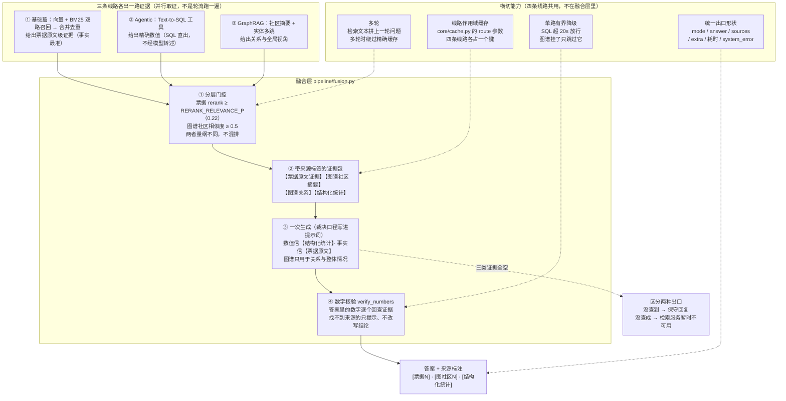

| 融合进来的东西 | 来自哪条线路 | 在融合层里的位置 | 单用那条线路时的短板（融合补的就是它） |
|---|---|---|---|
| 双路召回 + 重排门控 | ① 基础篇 | 票据路 + 分层门控 | 只认当前这一句；不含关系型知识；不含精确聚合 |
| Text-to-SQL 精确数值 | ② Agentic | 结构化路 + 裁决口径 | 慢；检索只在票据向量库里，问"谁和谁有关系"答不出 |
| 社区摘要 + 实体多跳 | ③ GraphRAG | 图谱路 + 来源标注 | 图只覆盖部分票据（本机 3 张票），覆盖不到只会说"图谱里没有" |
| 保守回复 / 缓存 / 统一出口 | ① 基础篇 | 横切能力 | — |
| 证据核验思路 | ② Agentic（evidence-analyst 的"逐份核验"） | 数字核验 `verify_numbers` | Agent 版是**逐份派子代理**看证据，融合版退化成一次字符级回查（更便宜，但只能查数字） |

> **与 ② 的明确区别**：② 是 **agent 循环** —— 模型自己决定检索几次、要不要调 SQL、
> 要不要委派子代理；④ 是**固定编排** —— 三路取证与门控顺序写死在代码里。
> 前者更灵活但行为不可预测（实测同一追问两次跑出不同路径），后者可回归测试、可解释。

---

## 五、与课案的对齐情况

### 5.1 基础篇

| 课案章节 | 对齐实现 | 差异说明 |
|---|---|---|
| 票据数据准备 / 字段抽取 | `data_process/tick_extract.py` | **完全对齐** 12 字段、SHA-256 主键、金额用分、null 不落 0；但 `semantic_text` 语义不同（本项目 = 清洗后 OCR 原文，未采用课案的三套摘要模板与 `product`/`seat_class` 中间字段） |
| OCR | `data_process/paddle_ocr.py` + `build_ocr_json.py` | 课案用本地 DeepSeek-OCR-2（理由是财务数据严禁外传）；本项目改用 PaddleOCR 云 API，**代价是票据图片会离开本机**。链路上游：`paddle_ocr.py` → `build_ocr_json.py` → `tick_extract.py`；当前索引里的 300 条仍来自课案服务器的 DeepSeek-OCR-2 产物（本地 PaddleOCR 只抽样跑了 11 张，两者版面不同、抽取规则需分别适配，见 §8.3） |
| Milvus 一票一记录 / Schema | `tick_extract.ensure_collection` | **字段名/类型/可空性一致，VARCHAR 上限按本机数据收紧**（semantic_text 8192、ocr_text 16384，课案一律给到 65535）；索引用 AUTOINDEX+COSINE（本项目直接用余弦度量，因此不依赖向量是否归一化） |
| **召回过滤** | `pipeline/filters.py` | 对齐课案 `extract_ticket_filters` / `build_milvus_filter`，并补 BM25 侧同语义过滤 |
| 召回实现 | `retrieval/vector_retrieval.py` | 过滤条件下推 Milvus；额外保留 BM25 混合召回（课案**自身口径不一致**：总览 312/327 认可多路召回，票据生产流程 179/2750/3068 又规定单路；本项目选多路并补了 BM25 侧同语义过滤） |
| 重排序 | `retrieval/rerank.py` | 课案逐篇 `rank()`；本项目用批量 rerank 接口，并在截断前**显式按分数降序排序**（不依赖接口返回顺序） |
| **阈值的确定** | `evaluation/threshold.py` | 课案用 SimBERT 生成正例 + FAISS 挖难负例；改用 LLM 生成正例 + Embedding 打分挖难负例；F1 并列成平台时取**平台中点**而非左端点 |
| 缓存与 FAQ | `core/cache.py` | 精确缓存键纳入模型/集合/双阈值作用域并做空白归一化；FAQ 用 Redis+向量余弦（课案用 Milvus faq 集合） |
| **系统评估** | `evaluation/stage_metrics.py` + `script/run_stage_eval.py` | 对齐分层测试集、逐阶段记录与指标、EVALUATION_PROMPT；RAGAS 部分与优化篇共用 |
| query 改写 | `llm/chat.py` + `core/prompts.py` | 四种策略语义对齐（**措辞做了票据域适配，非逐字**；课案的 `STRATEGY_PROMPT` 本身是坏 f-string，导入即 NameError，本项目改成 JSON 路由提示词属必要修正）；召回口径是"原问题 + 改写 query 的并集"，不是课案的"按策略替换" |
| 部署 | `app/main.py` | **部分对齐** FastAPI + Chainlit：无 `/api/health`、无 `WS /api/ws`、无 CORS、SSE 只发 `delta`（不带 query_type/sources 事件）、无多轮 history；Chainlit 为进程内 mount；未做 Dockerfile（本机直连 Docker 服务栈） |

### 5.2 优化篇

| 课案章节 | 对齐实现 | 差异说明 |
|---|---|---|
| Deep Agents RAG | `agentic/finance_agent.py` | 提示词**机器逐字比对**结果：证据分析员提示词 **152 字符全等**；系统提示词**前三段 343 字符全等**，再追加课案 304 行明确要求的 120 字 Text-to-SQL 分工段（346 → 466 字符）；检索核心抽成 `retrieve_evidence()` 便于评估复用 |
| Text-to-SQL | `agentic/text_to_sql.py` | 课案示例缺校验，按正文补齐"单条 SELECT + 关键字黑名单 + 行数上限 + 错误分类"；另两处差异：工具入参是**自然语言问题**（课案示例收 SQL 文本）、SQL 生成提示词重写为四条硬性要求（非逐字） |
| pgvector 向量入库 | **不实现**（有意） | 课案用 PG 的 pgvector 存 `ticket_chunks` 做向量检索；本项目向量仍在 Milvus，PG 只承担结构化 Text-to-SQL。**照课案找 `ticket_chunks` 会找不到** |
| RAG 评估 | `evaluation/` + 三个 script | **三字段语义**对齐 + 字段名/分层不同：`relevant_ids→expected_ticket_ids`、`reference_answer→ground_truth`，实际 7 字段、36 条（课案 32 条）；run_experiment 与条目/运行级评估器逐项对齐 |
| 优化闭环 | README 5.3 + run_name 约定 | 一个变量一次改动、同数据集重跑对比 |
| 微调 | **不实现**（本项目不训练本地模型） | 保留方法论与难负例挖掘思想（`select_hard_negatives`）；阈值标定沿用课案方法 |
| 知识图谱 / GraphRAG | `graph_rag/` | 模型/索引/建图/社区摘要/三路检索/空社区兜底对齐（Louvain 多带 `weight` + `random_state=42`，比课案稳）。**三处例外**：①建图脚本 `--mode incremental` **与 batch 一样会先 `MATCH (n) DETACH DELETE n`**，且社区检测是**全图重算** ⇒ 增量语义只在单次运行内成立；②服务端返回裸 dict、无 `QueryResponse`/`response_model`；③课案 2238 要求的图谱健康度指标（链接准确率/重复节点率/孤立节点率）与补全审核闭环**未实现**。另：课案 2586「完整的 GraphRAG 架构图」那一节**本身是空的**，README §4.7 那张是我们自己补的 |
| 上下文管理 | `build_production_agent()` | ContextEditing + Summarization + ModelCallLimit 三件套，阈值同课案（补充：`thread_limit` 只有在**传持久化 checkpointer 且复用同一 thread_id** 时才跨运行累计，本模块不再越权接线） |
| 安全保障 | `build_production_agent()` | 只读工具免审批；副作用工具走 HumanInTheLoopMiddleware（比课案多一条 `query_ticket_db: False`）；重试中间件同课案。**已实测验证**：真实运行会在副作用工具处暂停并给出 `action_requests`，`Command(resume={"decisions":[{"type":"approve"}]})` 后继续执行（`script/hitl_demo.py`）；`interrupt_on` 的布尔语义有回归用例钉住 |
| 系统监控与部署 | Langfuse 自部署 + CallbackHandler | `invoke_slow_agent` **支持**挂 `CallbackHandler` 并写 `langfuse_session_id`/`langfuse_user_id`，缺凭证自动降级不阻断问答（`tests/test_agent_tracing.py` 钉住）；⚠️ **当前服务入口未传这两个值 ⇒ 按会话/用户聚合实为空**（见 §5.4）。Aegra 运行时未接入（本机以 FastAPI 直接暴露业务接口） |

#### 5.2.1 优化篇「主流程」那张流程图 × 我们的 Agentic RAG（逐节点对齐）

课案 `### Deep Agents RAG → ### 主流程` 那张流程图（确定性快速路径 → DeepAgent 编排 →
检索管线 → 证据分析与验证）共 15 个节点，逐节点核对结论如下。
下图是**按本仓真实模块名重画**的同一张流程（对照课案图看，节点一一对应）：

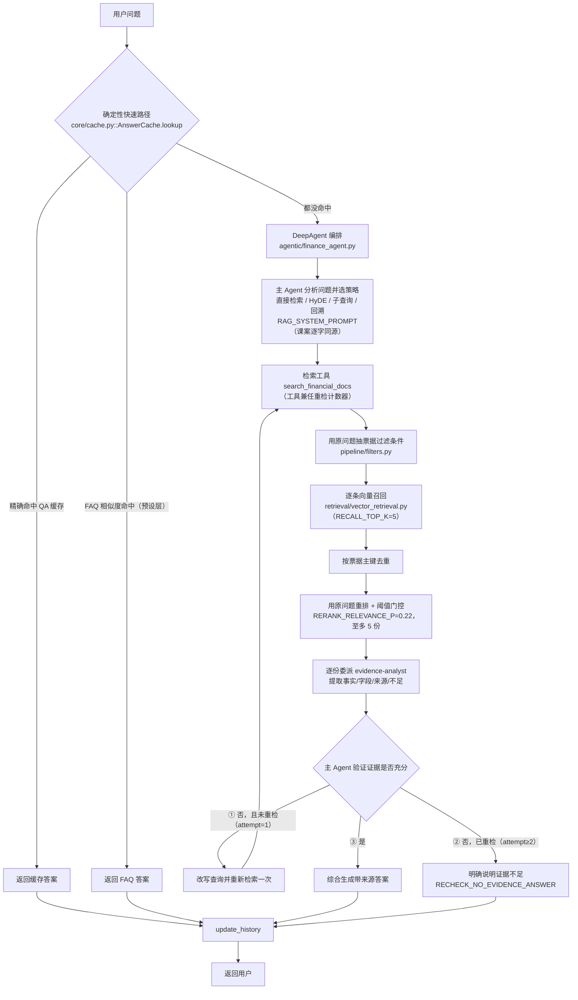

| 课案节点 | 我们的实现 | 状态 | 说明 |
|---|---|---|---|
| 用户问题 | `answer_financial_question(question, history)` | ✅ | 调用方持有 history，函数就地补本轮消息（与课案 :13 一致） |
| QA 缓存命中? → 返回缓存答案 | `core/cache.py::AnswerCache.lookup` 的**精确层**（`_lookup_exact`） | ✅ | 缓存键含模型/集合/两阈值 + **线路作用域**（本轮新增 `route`） |
| FAQ 命中? → 返回 FAQ 答案 | 同一入口的**相似度层**（`_lookup_preset`，只认 `layer=faq` 的 5 条标准问法） | ✅ | 课案用 Milvus `faq` collection / `FAQIndex`，我们用 Redis + numpy 余弦（既有有意差异） |
| 命中后更新 history | 两条命中分支都调 `update_history(history, q, a)` | ✅ | 命中不更新会让下一轮丢了这一问一答 |
| 主 Agent 分析问题并制定计划 | deepagents 主 Agent + `RAG_SYSTEM_PROMPT` | ✅（能力层面） | 课案正文只说"它规划、检索、委派"，**全文没有 `write_todos`/待办工具** ⇒ 不需要 TodoList 中间件；deepagents 默认也不装它（只有 Codex profile 装） |
| 选择查询策略（直接/HyDE/子查询/回溯） | `RAG_SYSTEM_PROMPT` 第一段："先判断问题适合直接检索、HyDE、子查询还是回溯查询…" | ✅ | 该段与课案提示词**逐字同源**（课案 152/343 字符比对结论见 §5.2） |
| search_financial_docs | `@tool search_financial_docs(original_query, search_queries)` | ✅ | 参数分工与课案一致：原问题只用于抽条件与重排，`search_queries` 只用于召回 |
| 从原问题提取票据字段过滤条件 | `pipeline/filters.py::extract_ticket_filters` → `build_milvus_filter` | ✅ ＋**兜底** | 原问题抽不出条件时改从改写文本抽一次（本轮新增，见下方"有意差异"） |
| Milvus 逐查询向量召回 | `retrieval/vector_retrieval.py::vector_search`（`RECALL_TOP_K=5`） | ✅ | 逐条检索文本各召回一次；**Agent 路径只走向量**（与课案图一致，BM25 在主链路） |
| 按文档主键去重 | `recalled.setdefault(document_key(...))` | ✅ | 有序去重（先到者胜），保证可复现 |
| 使用原问题执行 Reranker | `retrieval/rerank.py::rerank(rerank_query, candidates, top_k=5)` | ✅ ＋**兜底** | 正常路径就是原问题；仅当"原问题无实义"（追问原话）时改拼接改写文本（本轮新增） |
| 可信度阈值门控 最多保留 5 份证据 | `RERANK_RELEVANCE_P=0.22` + `MAX_EVIDENCE=5` | ✅ | 两个常量与课案**逐字**一致（`NO_EVIDENCE_ANSWER` 同） |
| 写入 /retrieved/ 证据文件 | `search_financial_docs` 写 StateBackend `/retrieved/<batch_id>/evidence_N.md` | ✅ | `batch_id` 8 位，避免多轮互相覆盖 |
| evidence-analyst 逐文件提取事实/字段/来源与不足 | `evidence_analyst` 子代理 + `EVIDENCE_ANALYST_PROMPT` | ✅ | 提示词与课案**去空白后逐字相同（152 == 152 字符）** |
| 主 Agent 验证证据是否充分? | `RAG_SYSTEM_PROMPT` 第二段："核验事实、金额、日期、人员、路线和来源…" | ✅ | 判断由主 Agent 做（与课案同），不是工具决定 |
| **否，且未重检 → 改写查询并重新检索一次** | 提示词"最多再调用一次检索工具" + 工具侧 `_retrieval_attempt` 计数 | ✅ | 计数器由问答入口 `reset_retrieval_attempt()` 清零、工具每次自增；上限 `MAX_RETRIEVAL_ATTEMPTS=2` |
| **否，已重检 → 明确说明证据不足** | 第 2 次及以后的空召回返回 `RECHECK_NO_EVIDENCE_ANSWER`；第 3 次起**硬上限拦截**（`RETRIEVAL_LIMIT_ANSWER`，不执行检索） | ✅ **本轮新补** | 见下方"本轮修掉的缺口" |
| 是 → 综合生成带来源答案 | 主 Agent 汇总 + 每条结论带来源（提示词末段） | ✅ | |
| 写入 QA 缓存并更新 history | `cache.store(question, answer, [], route=...)` + `update_history` | ✅ | 保守/证据不足的回答同样入库（课案图里三条出口都汇到这里） |
| 返回用户 | 入口函数返回字符串 | ✅ | |

**谁做什么：子代理 vs 主 Agent**（课案图里只有 evidence-analyst 是子代理，其余都是主 Agent 的步骤）

| 步骤 | 由谁做 | 证据 |
|---|---|---|
| 选检索策略（直接/HyDE/子查询/回溯）+ 写 `search_queries` | **主 Agent 自己**（不是子代理） | `RAG_SYSTEM_PROMPT` 首段；agentic 路径**不复用**那三套改写模板 —— 全仓 `rewrite_query(` 的调用点只有基础链路 `pipeline/rag_pipeline.py:567` 与融合链路 `pipeline/fusion.py:352`，`agentic/` 里对 `HYDE_PROMPT`/`SUBQUERY_PROMPT`/`BACKTRACK_PROMPT` **0 命中** |
| 召回 / 去重 / 重排 / 门控 / 写证据文件 | 工具 `search_financial_docs`（普通工具，不是子代理） | `agentic/finance_agent.py::search_financial_docs` |
| **逐份核验证据**（事实、字段、来源、不足） | **真子代理** `evidence-analyst`，每份证据委派一次 | `finance_agent.py:529` 定义、`:569` `subagents=[evidence_analyst]`；deepagents 的 `SubAgentMiddleware` 把它变成 **`task` 工具**，子代理默认 **isolated 上下文**（只看到被委派的那一个任务，看不到主对话） |
| 验证证据是否充分 / 是否重检 / 综合成答案 | 主 Agent | `RAG_SYSTEM_PROMPT` 第二段 |

> ⚠️ 一个**可观测性差异**值得记一笔：基础/融合线路的改写策略在代码里，会作为 `rewrite` 字段进事件流与评估记录；
> 而 agentic 路径的策略选择发生在**模型内部**，只在日志/追踪里能看到它的**产物**（`detail["queries"]`）。
> 想知道"这次它选了 HyDE 还是回溯"，目前只能从生成的检索文本反推。

**本轮修掉的缺口（唯一一条「部分实现」）**：课案流程图区分「否，**且未重检**」与「否，**已重检**」
两条分支，而此前**代码里没有"这是第几次检索"这个状态** —— 两次空召回返回的是同一句
`NO_EVIDENCE_ANSWER`，模型没有依据判断自己是否已经重检过（实测会反复改查询重试，或反过来过早放弃），
评估也分不清"首次没命中"与"重检后仍没命中"。现在：

- `agentic/finance_agent.py` 新增模块级 `_retrieval_attempt` + `reset_retrieval_attempt()`，
  两个问答入口（`answer_financial_question` / `answer_query_agentic`）**在入口清零**；
- `search_financial_docs` 每次调用自增，第 2 次及以后的空召回返回新常量
  `RECHECK_NO_EVIDENCE_ANSWER`（文案明确写"已重新检索过…请明确说明证据不足，不要继续改写查询重试"）；
  系统故障口径仍优先（`RECALL_UNAVAILABLE_ANSWER`，"没查成"不会被说成"没查到"）；
- **硬上限 `MAX_RETRIEVAL_ATTEMPTS=2`**：第 3 次调用**直接不执行检索**、返回 `RETRIEVAL_LIMIT_ANSWER`。
  课案只写了"最多再调用一次"的**提示词口径**，实测模型会不听劝继续换查询试探 ——
  每次都要付一次 embedding + rerank，还把一次问答拖成几十秒。刻意**不抛异常**：
  抛了会被 `ToolRetryMiddleware` 当可重试失败再重试两次，反而放大调用次数。
  被拦下的调用**不再自增**（计数稳定停在 2），并留一条 WARNING 便于统计"模型多想重试"；
- `retrieve_evidence(..., attempt=N)` 把次数写进 `detail["retrieval_attempt"]`，评估可据此区分两种失败；
- 回归用例 `tests/test_finance_agent.py::TestRetrievalAttempt`（10 条，含"入口必须清零"、
  "故障口径优先于重检口径"、"硬上限拦下时一次向量召回都不发生"），
  另加一个 autouse fixture 保证直接调工具的用例各自从 attempt=1 开始。

#### 5.2.2 与课案流程图的两处**有意偏离**（本轮新增，都带实测依据）

| 偏离 | 课案口径 | 我们的做法 | 为什么（实测） |
|---|---|---|---|
| 过滤条件的抽取来源 | "工具以**原问题**提取票据条件"（正文 :9） | 原问题抽不出条件时，改从改写文本里抽一次；原问题有实义时**逐字节不变** | 多轮追问「那乐艳的呢？」被模型当 `original_query` 传进来时，这句话没有姓名主体 ⇒ 抽不出条件 ⇒ 召回退化成**全库不过滤**（实测候选 18 条、重排最高 0.098 < 0.22、一条不留） |
| 重排打分用的 query | "使用**原问题**执行 Reranker" | 同上触发条件下，改用「原问题 + 第一条改写文本」的拼接 | **光补过滤条件不够**：即使只召回正确那 1 张票，用「那乐艳的呢？」打分仍是 0.098（保留 0 条），换成改写文本/拼接才保留 1 条 —— 探针 `RAG/script/probe_rerank_query.py` 四种 query 对照 |

两条都遵循同一原则：**只在"原问题无实义"这一种情形下兜底**，正常路径与课案口径保持一致
（`detail` 里新增 `filters_from` / `rerank_query` 两个字段，复盘时一眼能看出走没走兜底）。

### 5.3 优化闭环怎么用

```powershell
# 1. 建立基线
uv run python RAG/script/langfuse_evaluation.py --run-name baseline-top5

# 2. 只改一个变量(例如 RERANK_RELEVANCE_P 0.22 → 0.30)后换名重跑
uv run python RAG/script/langfuse_evaluation.py --run-name rerank-p055

# 3. 在 Langfuse UI → Datasets → finance-rag-validation → Runs 对比
#    质量(Recall@K / Ragas)与成本(延迟 / 检索次数)必须一起看,不能只看一个指标

# 4. 固化阈值/提示词 → test 复验 → 让线上监控回归
```

### 5.4 未实现清单（一张表看清"课案讲了但我们没做"）

分成两类：**有意不做的**（有明确理由与替代方案，不算欠账）和**该做还没做完的**（登记在 §8.3）。

#### A. 有意不实现（用户明确说过不做，或与项目前提冲突）

| 课案内容 | 为什么不实现 | 我们的替代方案 |
|---|---|---|
| **本地模型部署**（vLLM / SGLang / AutoDL / 模型下载 / FlashAttention / 公网代理） | 项目前提是"所有模型一律调外部 API，不部署本地模型" | LLM=DeepSeek 官方、Embedding/Reranker=SiliconFlow、OCR=PaddleOCR 云，四个入口见 §4.2 图 |
| **本地 OCR**（DeepSeek-OCR-2 服务器部署那一整章） | 同上；本地部署要 GPU 且要维护权重 | `data_process/paddle_ocr.py` 调 PaddleOCR 云 API。**代价：票据图片会离开本机，与课案"财务数据严禁外传"的前提相反**（§5.1 OCR 行已注明） |
| **微调整章**（向量模型微调、排序模型微调、LoRA、难负例挖掘的训练侧、合并导出） | 不训练本地模型 | 保留方法论与**难负例挖掘思想**：`evaluation/threshold.py::select_hard_negatives`（区间参数同课案）+ `script/calibrate_rerank.py` 用标注数据标定门控；课案"换业务数据要重标阈值"这条照做 |
| **pgvector**（课案让 PG 同时存票据正文向量 `ticket_chunks` + HNSW/cosine 检索） | Milvus 已承担向量检索，没必要为 Demo 再维护一套同库向量表 | 向量留在 Milvus（`tick` 集合），PostgreSQL 只承担**结构化 Text-to-SQL**（`tickets` 表）。照课案找 `ticket_chunks` 会找不到 |
| **Aegra 运行时**（`aegra.json` / `agent_runtime.py` / `langgraph_sdk` 接线 / `aegra dev`） | 本机以 FastAPI 直接暴露业务接口，引入运行时要多一层服务 | 课案"服务层统一入口 `answer_financial_question()`"**定义了但未接线**：`RAG/app/` 内对 `agentic` **0 个 import/调用**，该函数也**没有非测试调用方** ⇒ 优化篇整条 Agent 链路目前只由 `script/` 与 `tests/` 触达（见 §5.4 B 表） |
| **Dockerfile / 容器化部署** | 本机直连已在 docker 里的服务栈 | `F:\DockerDesktopData\start-dbs.ps1` 一键拉起依赖服务 |
| **RASA 传统时代架构**（意图/槽位/`nlu.yml`/`stories.yml`/`domain.yml`） | 课案用它是讲"聊天机器人架构演进史"，不是要我们实现 | 跳过；对应能力由路由（`llm/chat.py::route_query`）与工具调用承担 |
| **文本分割 / 父子文档切片**（字符/Token/递归/Markdown/Python 代码分割、父子块） | **票据域不需要分块**：一张票据就是一条记录（课案自己在"票据数据准备"里也这么写） | `tick_extract.py` 一票一记录，无 `chunk_index`/`parent_id`；课案该章作为方法论保留 |
| **Milvus `faq` 集合** | 与已有 Redis 缓存层重复 | `core/cache.py` 两层缓存：精确层 + FAQ 相似度层（Redis 存问法与向量） |
| **服务器准备 / 安全组 / 防火墙 / ECS 租用** | 纯运维章节，仓内无对应产物可比 | 跳过；本机开发环境直连 |
| **GraphSAGE / Node2Vec 图嵌入** | 课案只有一句"可选"，且与现有方案重叠 | 未实现；GraphRAG 用"社区摘要向量 + 实体向量 + 多跳遍历"三路（`graph_rag/retriever.py`） |

#### B. 未做完（欠账，逐条有证据，详见 §8.3）

| 欠账 | 一句话 |
|---|---|
| checkpoint / 跨运行恢复未接线 | `build_production_agent(checkpointer=...)` 参数在但无人传 ⇒ `ModelCallLimitMiddleware(thread_limit=80)` **永不累计、等于空转** |
| 18 条 OCR 失败记录照单入库 | 恒为 null 向量、召不回，却计入"300 条票据"的统计分母 |
| `semantic_text` 未采用课案摘要模板 | 我们用清洗后 OCR 全文；换模板前必须先保证证据文本取 `ocr_text`（已改） |
| 发票票号 / 航司代码抽取覆盖不足 | 只认"发票编号"（真实发票常写"发票号码"）；机票 `counterparty` 仅 17/100 有值 |
| 导入不幂等 + 无字段白名单 | ✅ **本轮已修**：`tick_extract.py` 的写库调用从 `client.insert` 改成 **`client.upsert`**（字段白名单本来就有：`build_record` 产出的键与 schema 一一对应）。⚠️ 换 upsert 必须**先读回旧向量**（`_carry_over_vectors`）：upsert 是整实体覆盖，而该脚本的 `vec` 是 None，实测会把向量抹成 NULL。真机验收：重跑一次导入 `count(*)` **300 → 300**、有向量 **282 → 282**（一条没丢）—— 旧实现下同一主键 insert 两次是 **2 行**（一次性集合实测） |
| 端点自检脚本缺失 | 课案 `test_reranker_endpoint.py` 无等价物，换网关要等主链路报错才发现 |
| token / 成本指标缺失 | ✅ **本轮已修**：新增 `agentic/usage.py`（`TokenUsageCallback` 走 LangChain 回调累加**整条链路**的用量：主 Agent + evidence-analyst 子代理 + 工具内的调用），`answer_query_agentic` 返回 `tokens`/`cost`；评估脚本条目级出 `tokens_in`/`tokens_out`/`tokens_total`/`llm_calls`，运行级出 `batch_mean_*`。真机一串问答实测 **9 次调用 / 48,735 token（34,559 命中提示缓存）**。⚠️ **成本要填单价**（`USAGE_PRICE_*`，默认 0 ⇒ 只报 token、不出 cost —— 刻意不内置价目表，价格会变、模型名还可能只是网关别名） |
| **③④ 线路暂不读写缓存** | ✅ **本轮已修**：`pipeline/modes.py::_cached_route` 给 ③GraphRAG 与 ④融合都套上了**线路作用域**缓存（③=`graph`、④=`fusion`，与 ①② 的键互不相通）。三条纪律：命中时直接返回且**不返回上次的 `extra` 明细**（那批社区/关系/SQL 是上次链路的产物，只给 `from_cache=True` 标记）；**多轮（history 非空）既不查也不写**（缓存键只有问题文本，只跳"读"会把依赖历史的答案存成"只看问题文本"的答案）；空答案不写。`_answer_cache()` 进程级复用同一个 `AnswerCache`（避免每次请求重载预设矩阵） |
| **Agentic 的"检索策略选择"不可观测** | 课案流程图有个节点是"选择查询策略（直接/HyDE/子查询/回溯）"。基础①与融合④ 的改写策略在代码里（`llm/chat.py::rewrite_query`），会作为 `rewrite` 字段进事件流与评估记录；而 **② 是主 Agent 在模型内部选**（`agentic/` 对三套改写模板 0 命中），代码里**没有任何字段记录它选了哪种策略** —— 只能从 `detail["queries"]` 反推。这属能力对齐、可观测性缺口：想知道"这题走的是 HyDE 还是回溯"目前只能看它生成的检索文本 | 待定：要么在提示词里要求模型在工具调用时自报策略（要改工具签名，偏离课案冻结的签名），要么从 Langfuse trace 的推理内容里提取（无需改签名）。当前按**不改签名**处理，登记备查 |
| 若干工程质量项 | `tqdm` 未声明依赖；8 个脚本的模块 docstring 写在 import 之后（`__doc__` 为 None）；`limit=10000` 静默截断等 |

#### C. 终审新增的课案级欠账（2026-09-17 第三轮，含 4 组并行复核的结论）

| # | 严重度 | 课案出处 | 现状证据 | 影响 |
|---|---|---|---|---|
| **T1** | **中高** | 优化篇「系统监控与部署 · Aegra」一节 + `answer_financial_question()` 统一入口 | 原状：`RAG/app/` 内对 `agentic` **0 个 import/调用**；`answer_financial_question` **零个非测试调用方** | ✅ **本轮已接线**：新增 `pipeline/modes.py` 四条线路注册表，`app/main.py` 的 `/api/chat`、`/api/chat/stream` 都走 `modes.answer()/answer_events()`，Chainlit 选择器可选 ② Agentic；服务层因此真正调到了 `answer_financial_question`（并新增 `route` 缓存作用域与 `info` 出参）。真机实测 ② 线路 22.0~38.5s 出答案，与①线路的 6.0s 明显不同 ⇒ 确实走了 Agent 链路 |
| T2 | 中 | 优化篇 215（生产边界四条要求） | `finance_agent.py` 写证据文件的循环**没有 per-doc try/except**（一条坏记录会让整次问答失败）；且"全路召回都失败"与"检索成功但无证据"**返回同一句文案** | ✅ 本轮已修两处：① 写文件循环加 per-doc try/except（`finance_agent.py:341-345`，坏掉一份只跳这一份）；② 新增 `RECALL_UNAVAILABLE_ANSWER` 与 `detail["recall_failed"]`，全部检索文本抛异常时回"检索服务暂时不可用"而不是"未检索到资料"（`finance_agent.py:81-87`、`238-247`、`285-290`、`322-332`），评估结果里也带 `recall_failed` 供报告剔除环境故障样本 | ✅ 已修（含 3 个回归测试） |
| T3 | 中 | 优化篇 40-43 / 106-109（评估钩子） | `register_evidence_hook` 生产侧已接线（`answer_financial_question` 每轮召回后回调），但**全仓无调用方注册** ⇒ `_evidence_hook` 恒为 None；原 docstring 把"评估脚本用钩子取证据"写成事实 | ✅ 注释已修（模块 docstring 与函数 docstring 都改为如实描述：钩子是对外扩展点、当前无内部调用方，评估实际走 `last_retrieval()`）。**语义层面仍算欠账**——要真用需外部评估器自己注册 |
| T4 | 中 | 优化篇 788（评估模型与生成模型分开配置） | 原先 `langfuse_evaluation.py` 的 Ragas 评判与 `evaluation/llm_judge.py` 用的就是 `settings.llm.model`（与线上生成同一个） | ✅ **本轮已修**：`config.py` 新增 `EvalLLMSettings`（`EVAL_LLM_*`）+ **共用**的回退解析 `eval_llm_target()`；Ragas 与 llm_judge 两处都改成走它。本机实测：生成 `deepseek-flash` / 评判 **`deepseek-chat`**（`from_fallback=False`），一次真实评分返回 score=5；未配置 `EVAL_LLM_MODEL` 时回退生成模型并打 WARNING，不让"评判就是生成模型"这件事静默 |
| T5 | 中 | 优化篇 791 / 1178（成本要和质量一起看） | 实验脚本全文 **0 处** `usage`/`total_tokens`/`cost` | 回答不了"Top-K 调大后成本是否可接受" |
| T6 | 中 | 优化篇 2238-2239（图谱健康度三指标 + 补全与人工审核闭环） | grep `孤立节点率/重复节点率/链接准确率/链接补全/人工审核` **全部 0 命中** | 抽取/消歧退化会**静默污染图谱且没有可观测量**（现在孤点 0 ≠ 有监控） |
| T7 | 中 | 优化篇 2495-2497（`QueryResponse` + `response_model`） | `graph_rag/service.py` 返回裸 dict；grep `QueryResponse` 0 命中 | OpenAPI 没有响应结构，接口契约退化 |
| T8 | 中 | 基础篇「接口职责」（`GET /api/health`、`WS /api/ws`、`QueryRequest.history`、`QA_CACHE_ENABLED`） | 四个都 **0 命中**；SSE 只发 `{"delta"}`（内部五分类事件不透出）；无 CORS、无 startup 预热 | 接口层比课案薄：无健康检查、无 WebSocket、HTTP 不支持多轮、无法一键关缓存 |
| T9 | 中 | 基础篇 1812-2274（12 字段口径） | `semantic_text` = 清洗后 OCR 全文，未采用课案三套摘要模板 | 召回语义依赖 OCR 原文措辞；若改模板，必须先保证证据文本取 `ocr_text`（已改） |
| T10 | 低 | 基础篇 3819-3911（FAQ 索引后端取舍） | FAQ 相似度层把向量全量载入进程内、每进程一份 | 当前 5 条标准问法无影响；问法涨到几百条要重评（`cache.py` 已写明该阈值） |

> **已证伪的一条**（台账曾记为缺口，本轮推翻）：`retrieve_by_entities` 的"种子检索不下推社区过滤"——
> 课案 2433 行自己就写着"向量索引先全局取 top_k、再按社区过滤"，我们的 Python 侧过滤**行为等价**，
> 属实现层级差异而非功能缺口（`graph_rag/retriever.py` 注释已写明）。
>
> 另外 §5.1/§5.2 里"逐字对齐""完全对齐"这类词的实测口径已按终审结果改成具体数字（152 / 343 / 120 字符），
> 避免读者按课案逐字比对时误判。

> 另外 §8.3 还有 **N1–N35**（补注释时读出来的 35 条问题，含 5 条已修）——那是"代码级"欠账清单，本表是"课案级"的。
> 两张表对着看：课案级知道少什么能力，代码级知道欠什么细节。

---

## 六、配置项速查（`.env`）

| 分组 | 关键项 | 当前值/含义 |
|---|---|---|
| LLM | `LLM_MODEL` `LLM_BASE_URL` `LLM_ENABLE_THINKING` | `deepseek-flash`，走 DeepSeek 官方 `https://api.deepseek.com`；开启思考输出（该模型返回 `reasoning_content`）；`LLM_TIMEOUT=180` |
| **评估/评判** | `EVAL_LLM_MODEL` `EVAL_LLM_API_KEY` `EVAL_LLM_BASE_URL` `EVAL_LLM_MAX_TOKENS` | **`deepseek-chat`**（与生成的 `deepseek-flash` **分开**，避免自我偏好；课案要求"评估模型与生成模型分开配置"）。密钥与网关**留空即逐项回退** `LLM_API_KEY` / `LLM_BASE_URL`；`EVAL_LLM_MODEL` 也留空时回退生成模型并打 WARNING。解析逻辑只有一处：`config.py::eval_llm_target()` |
| **token 成本单价** | `USAGE_PRICE_INPUT_PER_MILLION` `USAGE_PRICE_OUTPUT_PER_MILLION` `USAGE_PRICE_CACHED_INPUT_PER_MILLION` `USAGE_CURRENCY` | 默认全 **0 ⇒ 不报成本**（只报 token 真数）。要成本就按厂商报价单填（货币单位/百万 token）；不内置价目表是刻意的，见 .env.example 的说明 |
| Embedding | `EMBEDDING_MODEL` `EMBEDDING_SIZE` `EMBEDDING_SEND_DIMENSIONS` | `BAAI/bge-m3`，原生 1024 维；`EMBEDDING_SEND_DIMENSIONS=false`（它不接受 `dimensions` 参数） |
| Rerank | `RERANK_MODEL` `RERANK_TOP_K` `RERANK_RELEVANCE_P` | `BAAI/bge-reranker-v2-m3`；top_k=8、相关度阈值 **0.22**（2026-09-17 换模型后用标注评估集重标，见 8.4） |
| 检索 | `RETRIEVAL_TOP_N` | 单路召回条数 10 |
| 缓存 | `REDIS_EXACT_TTL` `REDIS_SIM_THRESHOLD` | 精确缓存 600 秒；FAQ 相似度阈值 **0.79**（bge-m3 空间重标，见 8.4） |
| Milvus | `MILVUS_URI` `MILVUS_DB_NAME` `MILVUS_COLLECTION` | `finance_rag` 库、`tick` 集合（向量维度 1024） |
| PostgreSQL | `POSTGRES_*` `FINANCE_DB` | Text-to-SQL 的票据库（默认 `finance`） |
| Neo4j | `NEO4J_URI` `NEO4J_USER` `NEO4J_PASSWORD` | GraphRAG 图数据库 |
| Langfuse | `LANGFUSE_HOST` `LANGFUSE_PUBLIC_KEY` `LANGFUSE_SECRET_KEY` `LANGFUSE_DATASET_NAME` | 指向本机自部署实例（http://localhost:3001） |

> ⚠️ **根 `.env` 是全仓库共享的**（`Agent/` 等子项目读同一份），改上面三个模型名会同时改动 RAG 的实时链路。
> 换模型时别只看名字对不对得上：
> - `LLM_BASE_URL` 必须真的提供 `LLM_MODEL`（`grok-4.6` 只在私有网关上有）；
> - `retrieval/embedding.py` 默认**不下发** `dimensions`，需要 MRL 截断的模型（如 `Qwen/Qwen3-Embedding-4B`，原生 2560 维）才把 `EMBEDDING_SEND_DIMENSIONS` 开成 `true`；
> - 换 embedding 或 reranker 都要**重算存量向量 + 重标阈值**，清单见 6.2。

### 6.1 阈值怎么重新标定

项目里有**两个**"拍脑袋就会出事"的阈值，来源不同、脚本也不同：

| 阈值 | 作用 | 分数来源 | 正例 / 负例 | 标定脚本 | 产物 |
|---|---|---|---|---|---|
| `REDIS_SIM_THRESHOLD` | 预设问答(FAQ)相似度缓存命中 | embedding 余弦 | 正例=LLM 生成的同义问法；难负例=其他预设问题 | `script/build_threshold_dataset.py` → `script/search_threshold.py` | `data/threshold_dataset.json`、`data/threshold_results.json` |
| `RERANK_RELEVANCE_P` | 重排后的相关度门控（决定"这条票据算不算依据"） | reranker 相关度 | 正例=该问题标注的真实票据；负例=同一次召回里的其它票据 | `script/calibrate_rerank.py`（用 `data/eval_set.jsonl` 的标注） | `data/rerank_threshold_results.json` |

两个脚本都按同一套口径给结论：先按 F1 搜最优区间（**F1 平台**，平台上所有阈值同分），
再看当前 `.env` 的值是否落在平台内 —— **在平台内就不改**（换了不涨分，只是多引入一次变量扰动）。

并列取值的规则是分开的，理由写在各脚本里：

- **FAQ 阈值取平台中点**：平台两端都是真悬崖（低一点掉精确率、高一点掉召回率），中点离两边最远；
- **重排阈值取平台上沿**：实测负例分数全部贴在 0 附近（最大 0.0074），平台下端并没有观测到悬崖、
  只是搜索下界；而门控宁可保守 —— 放错票据比漏票据更伤（漏了会走保守回复，放错会让模型拿无关上下文作答）。

### 6.2 换 embedding / reranker 模型后要重算哪些东西

换模型不是改个名字就完事：**旧向量留在库里就是错的**（不同模型的向量空间不通用，余弦相似度没有意义）。
2026-09-17 从 Qwen3 系换到 bge 系时，实测踩到 / 处理了这些：

| 序 | 要做什么 | 命令 | 不做的后果 |
|---|---|---|---|
| 1 | 重算 Milvus 票据向量 | `uv run python RAG/data_process/embed_tickets.py` | 向量召回结果基本随机，命中率掉到 0 |
| 2 | 重灌 Redis 预设问答向量 | `uv run python RAG/data_process/seed_qa_cache.py --force` | FAQ 缓存要么不命中、要么命中错答案 |
| 3 | 重算 Neo4j 实体/社区向量 | `uv run python RAG/script/build_finance_graph.py --mode batch` | GraphRAG 实体级召回失效（结构还在，向量对不上） |
| 4 | 重标 `REDIS_SIM_THRESHOLD` | `script/build_threshold_dataset.py` → `script/search_threshold.py` | 阈值沿用旧量纲：实测旧值 0.85 在 bge-m3 下召回只有 0.98 |
| 5 | 重标 `RERANK_RELEVANCE_P` | `script/calibrate_rerank.py` | **最坑的一个**：旧值 0.65 在 bge-reranker 下把命中票据整条丢掉，实测 8 条样本里 2 条退化成"没检索到依据" |
| 6 | 复验分阶段指标 | `script/run_stage_eval.py --eval-set RAG/data/eval_set.jsonl` | 不知道换模型后是变好还是变差 |

维度约束：新模型输出维度必须等于 `EMBEDDING_SIZE`（本项目 1024），且与 Milvus 集合、Neo4j 向量索引一致。
`retrieval/embedding.py` 会直接校验并报错，避免"能写进去但搜不准"的静默坏数据。
**注意**：如果改的是 `EMBEDDING_SIZE`（维度本身变了），上面第 1 步不够 —— Milvus 集合是按旧维度建的，
必须重建集合：`uv run python RAG/data_process/tick_extract.py --insert --recreate` 之后再跑第 1 步。

---

## 七、测试与验证

| 项目 | 说明 |
|---|---|
| 离线用例（默认） | `pytest RAG -q -m "not integration"`：本次收集到 **688** 个用例，其中**离线跑 674 个（674 passed，0 报错）**，另 14 个 integration 用例被反选。不依赖 Milvus/Redis/PG/Neo4j，也不调用外部 API（外部依赖全部 monkeypatch） |
| `@pytest.mark.integration` | **14 个用例**，需要本地服务；本机服务在跑时会一并通过（实测 `14 passed, 674 deselected`，约 7 秒） |
| `@pytest.mark.live` | 保留给"需要真实外部 API"的用例。当前真实 API 验证一律通过 `script/` 下脚本或 `.dsh_tmp/` 探针手工执行留证（避免测试不确定与调用费用），所以该标记下暂无用例 |
| 自检入口 | 非平凡模块多数带 `python <module>.py` 断言式自检（`evaluation/*`、`pipeline/filters.py`、`agentic/finance_agent.py`、`llm/text_clean.py`、`script/*`）；其余模块（`pipeline/rag_pipeline.py`、`retrieval/*`、`graph_rag/{builder,models,retriever}.py`）由 `tests/` 覆盖。⚠️ 两个例外：`graph_rag/service.py` 的 `__main__` 只有 `uvicorn.run()`、**没有断言**；`data_process/tick_extract.py` 无自检，但**已由 `tests/test_tick_extract.py`（19 例）覆盖** |

最近一次完整复跑（2026-09-17 四线路改造后）：离线 **674 passed（0 报错）**，集成 **14 passed**，ruff `All checks passed`。真机端到端见 §7.2 与 §4.10 的实测数字。

> 沙箱那 7 个 `tmp_path` 报错**在这台机器上是可以消失的**：把沙箱换成能正常启动的 runner
> 之后同一套用例是 `674 passed`（一条不报错）。也就是说它们**确定是环境问题**，
> 不是代码问题 —— 之前那份"663 passed + 7 errors"的记录是当时的运行环境所致。

> ⚠️ **单测全绿 ≠ 流程真的通**。本轮实测的教训：路由"关思考"的参数名写错了
> （`enable_thinking` 被端点静默忽略），**606 个离线用例全绿也照样漏过**——
> 因为用例只在 monkeypatch 出来的假客户端上断言"发了哪个字段"，没人验证过
> 真实端点认不认这个字段。这类问题只有真机端到端复跑才能暴露（见 §7.2）。

### 7.1 加用例时的约定（照这个写就不会跑挂）

| 约定 | 做法 | 原因 |
|---|---|---|
| 默认离线 | 外部依赖（Milvus / Redis / PG / Neo4j / LLM / Embedding）全部 `monkeypatch` 掉 | 离线用例是日常反馈的主力，不能因为服务没起就跑不了 |
| 要真服务就标 `@pytest.mark.integration` | 用 `tests/service_probe.py` 的 `requires_pg` / `requires_neo4j` / `requires_milvus` / `requires_redis` 守卫 | 服务没起时**快速跳过**（TCP 探针 0.5 秒），而不是卡到连接超时，更不是把套件挂死 |
| 要真 API 就写脚本 | 放 `script/` 下，手工执行留证，别写进测试 | 真实调用有费用、结果不确定，不适合当回归 |
| 纯逻辑优先 | 像 `filters.py` / `evaluation/*` / `graph_rag/builder.py` 那样把分支抽成纯函数再测 | 不用连数据库就能覆盖边界 |
| 写测试前先想"它防的是什么" | 例：`test_llm_router.py` 防的是"思考模型吃空预算导致路由静默退化" | 没有失败前提的测试是装饰 |

关键验证证据（真实执行过）：

| 验证项 | 结果 |
|---|---|
| Agentic RAG 端到端 | 提问"黄帅今年高铁票一共报销了多少钱?" → Agent 自抽条件（`ticket_type == "train" and person == "黄帅"` + 2026 年范围）→ 召回 2 张 → 委派证据分析 → **1528.80 + 162.20 = 1691.00 元** |
| Text-to-SQL 交叉验证 | 同一问题走结构化查询 → **1691 元**（与 Agentic 链路互证）；另验证 COUNT=300、2025-03 发票合计 645589 元 |
| SQL 注入拦截 | `SELECT 1; DROP TABLE tickets;` → `invalid_sql`，且 tickets 表仍 300 行 |
| 主链路（基础篇） | 预设缓存命中（"赵飞坐的航班从哪里到哪里?" 直接返回缓存答案）；`1+1等于几?` 正确走 direct 不检索；"公司食堂装修花了多少钱?" 走保守回复 |
| 评估集生成 | Milvus 300 条票据 → 36 条样本（18 检索 / 6 汇总 / 4 多票对比 / 4 拒答 / 4 直答） |
| 阈值标定 · FAQ（`search_threshold.py`） | bge-m3 空间下重标：20 条 query × 5 正例 + 100 难负例 → F1 **平台 0.77~0.81**，取中点 **0.79**（`.env` 已落值）；旧值 0.85 是 Qwen3 空间的，在 bge-m3 下召回只有 0.98 |
| 阈值标定 · 重排（`calibrate_rerank.py`） | 28 条标注样本（37 正例 / 37 负例）→ F1 **平台 0.05~0.22**，取上沿 **0.22**；分数分布：正例 0.048~0.981（中位 0.758）、负例 0.001~0.0074（中位 0.003） |
| 分阶段评估（`run_stage_eval.py`，DeepSeek + bge 栈，**缓存关闭**） | 前 8 条样本真实跑完整链路：路由准确率 **1.0**、筛选字段准确率 **1.0**（16/16，过抽取 0）、Recall@5 **1.0**、Rerank Hit@5 **1.0**、答案事实准确率 **1.0**；平均 2.98s / 最大 4.42s → `data/stage_eval_report.json`。⚠️ **限定**：这 8 条实测**全是 `retrieval`（单人单票事实型）**，链路必中、五项自然饱和在 1.0；对"多票对比 / 金额汇总 / 拒答 / 直答"四类**零覆盖**，报告里也没写 `limit`/`eval_set`/`use_cache` 元信息 —— 别把它读成"五项满分" |
| 评估口径修正（缓存污染） | 之前这版报告是开着缓存跑的，8 条里 1 条命中预设缓存（绕过路由/召回/重排），把 route/filter/recall/rerank **四项同时从 1.0 打成 0.875** —— 指标看着"差 12.5%"，其实是测量污染。`run_stage_eval.py` 现在默认 `use_cache=False`（要测缓存本身用 `--use-cache`） |
| HITL 审批（`script/hitl_demo.py`，真实运行） | 同一 thread_id 发起 → 在 `update_config` 处**暂停**，`action_requests[0] = {name: update_config, args: {key: rerank_score_threshold, value: 0.85}}` → `Command(resume={"decisions":[{"type":"approve"}]})` 恢复执行；`interrupt_on` 归一化语义有回归用例（`True → {allowed_decisions: [approve, edit, reject, respond]}`，`False` 不进名单） |
| FAQ 分层安全（`core/cache.py`） | 5 条标准问法进相似度层、60 条明细进精确层。实测「赵凡的登机牌座位号是多少?」（库里无此人）**不再命中**（修复前与「赵飞…」相似度 0.9008 会串）；原问题走精确层秒回；标准问法改写仍命中（0.9706） |
| OCR 链路闭合（`data_process/build_ocr_json.py`） | `data/output/<分类>/*.md` → JSON 11 条（成功 11/失败 0，`--dedupe consecutive`）；抽取侧修复后登机牌姓名 **0/7 → 6/7** |
| Langfuse 闭环（**36 条全量真跑两轮**，2026-09-17） | 数据集上传 36 条 → `run_experiment` **36/36、exit 0**，条目级与运行级分数写回（ClickHouse 落库）。两个批次对比：<br>• `rerun-4routes-final`（修复前）：Recall@K **0.759**、Answer Relevancy 0.715、Context Precision 0.731、Context Recall 0.808、延迟均值 25.45s / P95 50.74s、检索次数 2.861、错误 0；⚠️ **Faithfulness 缺失**（36 条里 26 条被打分截断）→ `runs/c73a2c5291b55682`<br>• `rerun-lines-final-thinkingoff`（评判模型关思考后）：**四个 Ragas 指标齐全** —— Faithfulness **0.583**、Answer Relevancy 0.612、Context Precision 0.720、Context Recall **0.900**、Recall@K 0.731、延迟均值 24.22s / P95 48.71s、检索次数 3.028、错误 0、**0 次打分失败** → `runs/869cf93821670f25`<br>Run 链接前缀：`http://localhost:3001/project/finance-rag/datasets/cmu48na1q0009nz07mnlia9th/`。根因与修法见 §8.1「Ragas 评判模型的输出被截断」 |
| **改造前基线数据** | 23 条样本已评估：**Recall@K 均值 0.42**、单题延迟均值 **22.1s**（最高 50.7s）、检索次数均值 **2.09**、Ragas Answer Relevancy 22 条（均值 0.26）、Context Recall 5 条（均值 0.6）、Context Precision 5 条（全 0 —— 已定位为待优化项：召回上下文与参考答案的事实对齐度不足，优先排查分块与召回过滤条件） |
| **主链路 HTTP 端到端**（真服务 `python RAG\app\main.py`，`POST /api/chat`） | 问「万宁的火车票票号是多少？」→ `route=rag`、`cache_hit=null`（真跑链路，非缓存）、4.48s、回答 `T20230702063302` 与标准答案一致、来源 `ticket_6b0525b6cd77c83580b87211`（rerank 0.540）。域外问题走 direct 后不再浪费检索（见下一行） |
| **SSE 流式**（`POST /api/chat/stream`） | 17 条 `data:` 事件逐字吐出、以 `data: [DONE]` 收尾、拼回「乐艳的火车票花费为 **498.90元** [1]。」（与标准答案一致），3.46s |
| **Agentic 链路真机**（`answer_query_agentic(use_cache=False)` 强制不读缓存） | 问「于强的机票是从哪到哪的？」→ 20.76s、`from_cache=false`、`error=null`、路由抽到 `ticket_type == "flight" and person == "于强"` → 3 条改写 query 召回 1 张 → 重排 0.937 → 写证据文件 → 委派 evidence-analyst 核验 → 回答带引用与 6 条数据缺项说明。⚠️ 同一函数用 `answer_financial_question` 直接调时**命中 Redis 只花 0.01s**（`recall_detail` 为空即可识别），看着"跑通了"其实一步检索都没做——复跑务必关缓存 |
| **路由关思考的字段名（被真机复跑推翻过一次）** | 修复前：域外问题 `finish_reason=length`、`content` 空、`reasoning` 453~1111 字、`completion_tokens=256`（3/3 全空）→ 被强行当票据问题去检索；换成 `thinking={"type":"disabled"}` 后：`reasoning=0`、`content=40`、`completion_tokens=14`，线上两个域外问题都由 `rag+保守回复` 变成 `direct` 正常作答，路由耗时 2.31s → 0.90s |
| ruff | `ruff 0.16.7` 真跑：先捉出 **5 个真错误**（4×F401 未用 import、1×F841 未用变量）并修掉，现在 `All checks passed`（`RAG/` 全量 + `--select F,E9`）。**沙箱里怎么装 ruff**：`uv`/`uvx` 在本沙箱起不动子进程（`Failed to query Python interpreter ... 拒绝访问`，属 named-pipe 限制），pip 也不在 venv 里 ⇒ 改用「下 wheel + 解包拿 `ruff.exe`」（脚本 `RAG\script\probe_ruff_setup.py`，ruff 的 wheel 里就是一个独立 exe，不依赖 Python） |
| **真机探针脚本**（一次性探针已收口到 `script/`，不再散落在临时目录） | `script\probe_ruff_setup.py`（沙箱装 ruff）· `script\probe_pg_gss.py`（PG GSS 卡死的有界复测）· `script\probe_ragas_judge_budget.py`（评判模型预算对照）· `script\probe_rerank_query.py`（多轮追问的重排 query 对照）· `script\probe_llm_thinking.py`（端点认哪个"关思考"字段）· `script\acceptance_4routes.py`（四条线路一次跑完的验收）· `script\check_mermaid.py`（README 里的图真渲染校验） |
| **③④ 线路接缓存（本轮）** | 同一句问第二遍：GraphRAG **4.67s → 0.03s**（`cache_hit=exact`）、融合线路 **19.41s → 0.02s**；跨线路隔离实测通过（把 ④ 的问题拿去问 ③，`cache_hit=None`） |
| **评判模型与生成模型分家（本轮）** | `.env` 实测：生成 `deepseek-flash` / 评判 **`deepseek-chat`**（`from_fallback=False`）；`evaluation/llm_judge.py::score_answer()` 真实调用返回 `score=5` 且反馈合理；把 `EVAL_LLM_MODEL` 清空后 `eval_llm_target()` 回退生成模型并置 `from_fallback=True`（调用方据此打 WARNING） |
| **导入幂等（本轮）** | `tick_extract.py --insert` 重跑一次：`count(*)` **300 → 300**、**有向量 282 → 282**（一条没丢）；同主键 `insert` 两次在一次性集合上实测是 **2 行**（旧实现的问题） |
| **token 用量采集（本轮）** | 真机一串 Agentic 问答：**9 次 LLM 调用 / 输入 41,092 / 输出 7,643 / 合计 48,735 token，其中 34,559 命中提示缓存**（`cached_input_tokens`，DeepSeek 的 `prompt_cache_hit_tokens`）；未填单价时 `cost=None` ⇒ 评估报告里不出成本指标（不把"没算"报成 0） |

### 7.2 真机端到端复跑清单（改完链路**必须**跑一遍）

**为什么单测不够**：离线用例把 OpenAI 客户端 monkeypatch 成假对象，只能断言"我们发了哪些
字段"，**无法验证真实端点认不认这些字段**。本轮就是这样漏掉了一个 bug ——
路由发的 `enable_thinking: False` 被端点静默忽略（详见 §8.1 对应行），
606 个离线用例全绿、真机路由却在域外问题上 100% 返回空。

按下面四步复跑，每步都有**明确的失败信号**（不是"看起来没报错就算过"）：

| 步骤 | 命令 | 失败信号 |
|---|---|---|
| ① 单元 + 集成 | `$env:PGGSSENCMODE="disable"; .venv\Scripts\python.exe -m pytest RAG -q -p no:cacheprovider -m "not integration"`，再 `-m "integration"` | 非 7 个已知沙箱报错之外的任何 error |
| ② 起真服务 | `.venv\Scripts\python.exe RAG\app\main.py`（日志重定向到文件，别用管道） | 启动日志无 `Application startup complete` |
| ③ 打真 HTTP | `POST http://127.0.0.1:8099/api/chat`，体 `{"question": "<eval_set 里的一条>"}`；再来一次 `/api/chat/stream` | ①`cache_hit` **非空**说明没真跑链路（换条没问过的）；② `sources` 为空；③ 答案与 `ground_truth` 不符；④ SSE 没有 `[DONE]` 或缺逐字 `delta` |
| ④ 域外 + Agent 链路 | 域外问题（如「明天上海适合穿什么衣服？」）看 `route`；再 `answer_query_agentic(q, use_cache=False)` 强制跑 Agent | ①域外问题 `route=rag` ⇒ 路由又退化了（查日志 `finish_reason`）；② Agent 结果 `recall_detail` 为空却很快返回 ⇒ 命中缓存，**没真跑** |

**服务日志要盯的一行**：`[路由] LLM 返回空内容,已按默认值兜底` ——
正常情况下它一次都不该出现。出现了就看括号里的 `finish_reason`：
`length` = 预算又被思考吃光（换端点/换模型后 `thinking` 字段可能又不认了）；
`stop` = 模型真没输出（查提示词或内容安全策略）。

**本轮（2026-09-17）按此清单跑出的数字**：离线 652 passed + 7 沙箱报错、集成 14 passed；
`/api/chat` 4.48s 命中标准答案、`/api/chat/stream` 3.46s/17 事件、域外问题 `route=direct`、
Agent 链路 20.76s 带引用回答、服务日志 WARNING 数 **0**；四条线路真机复跑见 §4.10 的耗时列。

**四条线路的复跑**（④ 融合线路加进来后，这一步从"可选"变成"必做"）：

```powershell
# 起服务：PG 的 GSS 协商要关掉，否则 ④ 线路的 Text-to-SQL 那一路会卡死（见 §8.1）
$env:PGGSSENCMODE = "disable"
.venv\Scripts\python.exe RAG\app\main.py

# 逐条线路打同一个问题；②④ 用 history 验多轮
Invoke-RestMethod -Uri http://127.0.0.1:8099/api/chat -Method Post -ContentType 'application/json' `
  -Body ([Text.Encoding]::UTF8.GetBytes('{"question":"万宁的火车票票号是多少？","mode":"agentic"}'))
```

失败信号（每条都实测出现过）：① 线路报 `asyncio.run() cannot be called from a running event loop`
⇒ 端点又写成 `async def` 了；② 线路耗时与①相同（≈6s）⇒ 缓存没按线路隔离，拿到的是①的缓存答案；
④ 线路里 `extra.sql` 恒为空 ⇒ PG 卡住（看日志有没有"Text-to-SQL 超过 20s 未返回"）。

---

## 八、已知差异与坑

### 8.1 本机环境与配置类

| 位置 | 现象/差异 | 处理 |
|---|---|---|
| **DSH 沙箱会话里跑 PG 用例** | libpq 默认 `gssencmode=prefer`，在 DSH 的 Windows 沙箱下会卡在 GSS/SSPI 协商：TCP 能连（探针判定"服务可用"）、原始协议握手也正常，但 `psycopg.connect` **永不返回**，`connect_timeout` 不生效 —— 表现为整套测试挂死（实测卡满 600 秒）。**有界探针复测**（`RAG\script\probe_pg_gss.py`，线程 + join 15s）：不设该变量 15 秒不返回；设成 `disable` 后 0.01 秒就返回。⚠️ 这个坑不只影响测试：**服务进程同样中招** —— ④ 融合线路的 Text-to-SQL 那一路会把整条问答挂满 10 分钟（真机实测过一次），所以 `pipeline/fusion.py` 给 SQL 取证加了 20 秒有界降级 | 跑测试/服务前设置 `$env:PGGSSENCMODE = "disable"`（本机 PG 不涉及 Kerberos，关掉无副作用）；非沙箱终端不受影响 |
| **Ragas 评判模型的输出被截断（只影响 Faithfulness）** | 复跑 Langfuse 评估时 **Faithfulness 在 36 条里失败 26 条**（另外三个指标全成功）：刷 `Ragas 指标 Faithfulness 打分失败: The output is incomplete due to a max_tokens length limit` —— 而且把 `llm_factory(max_tokens=4096)` 从 ragas 默认的 1024 提上去**失败比例没变**。用同一提示词做对照实验（`RAG\script\probe_ragas_judge_budget.py`）：1024 → `finish=length`、思考 2096、正文 0；4096 → 思考 3269、正文 783（勉强够）；**4096 + 关思考 → 思考 0、正文 611、只花 264 token**。根因：评判模型的 completion_tokens 里思考占大头，而 Faithfulness 要逐句输出判定列表，提示词与输出都比另外三个指标长 | `_ragas_bundle()` 里给 `llm_factory` 同时传 `max_tokens` 与 `extra_body={"thinking": {"type": "disabled"}}`（与路由同一处实测结论）。**修复后全量复验：36/36、`WARNING Ragas` 0 次**（修复前同一进度点 27/36 时已有 16 次），四个指标齐全（Faithfulness 0.583）—— 见 §7.1 的 Langfuse 行 |
| **多轮追问会因"重排 query 没实义"而整轮失败** | 真机对照两次跑同一个追问「那乐艳的呢？」：一次答出票号，一次回"检索两次都没命中"。根因是**模型的工具调用可能把追问原话当作 `original_query`**（这句话里没有姓名主体）：① 条件抽不出 ⇒ 召回**全库不过滤**；② 更要命的是重排也用它打分 —— cross-encoder 对一句只有代词的追问给**所有**文档约 0.1 分（实测 0.098 < 阈值 0.22）。**探针实验**（`RAG\script\probe_rerank_query.py`，同一张票、同一过滤条件，只换重排 query）：`那乐艳的呢？` → 保留 **0** 条；`乐艳 火车票 票号` → 保留 1 条；`那乐艳的呢？ 乐艳 火车票 票号` → 保留 1 条 | `retrieve_evidence` 加**两条同源兜底**（都在"原问题抽不出条件"时触发，原问题有实义时行为逐字节不变）：① 过滤条件改从改写文本里抽；② **重排 query 改为 `原问题 + 第一条改写文本` 的拼接**。修复后实测：过滤从`无`→`ticket_type == "train"`，重排最高分 **0.098 → 0.255、保留 1 条**，追问答出 `T20220709684589`。`detail` 里新增 `filters_from` / `rerank_query` 两个字段便于复盘；`tests/test_finance_agent.py::TestFilterFallback` 钉住三条契约<br>⚠️ 只修过滤条件**不够**（我第一版就只修了它，探针一量发现重排仍是 0 分）—— 教训是"先量哪个环节真正把结果卡住，再动手" |
| **沙箱里装不了 uv/pip 工具** | `uv`/`uvx` 在本沙箱起不动子进程（连它自己管好的解释器都报 `Failed to query Python interpreter ... 拒绝访问`，属 named-pipe 限制），venv 里也没有 pip（uv 建的环境默认不带） | 需要一次性 CLI（如 ruff）时：下 PyPI 的 wheel（`mirrors.aliyun.com` 可用，PS/curl 的 TLS 在这台机器上反而不通，走 Python 的 urllib）+ 解包取 exe。脚本见 `RAG\script\probe_ruff_setup.py` |
| **Chainlit 的 `Select` 不能同时给 `values` 和 `items`** | 真机在浏览器里才发现的：两者同时给会抛 `Value error, You can only provide either values or items to create a Select`，表现是**设置面板整块渲染失败**、页面上只剩一段 pydantic 报错（HTTP 接口与单测都发现不了） | 只给 `items`（`{显示文案: 线路键}`）+ `initial_value` 给**值**。`pipeline/modes.py::normalize_mode` 另外兜住了"前端回传显示名而不是键"的情况 |
| **同步 runner 不能裸用 `asyncio.run`** | ① 基础线路的底层是异步的，而 `/api/chat` 原来是 `async def` —— 在事件循环里调 `asyncio.run()` 直接 `RuntimeError: asyncio.run() cannot be called from a running event loop`（真机第一次打四线路时就炸在这里） | 端点改回**同步 `def`**（FastAPI 丢线程池执行，与 `graph_rag/service.py` 同一取舍）；`pipeline/modes.py::_run_coroutine_sync` 在有 loop 时改用新线程跑，避免换个调用方又踩 |
| **精确缓存必须按线路隔离** | 缓存键里原本只有"问题 + 模型/集合/阈值"，四条线路共用 ⇒ 先问①再切④问同一句，会直接拿回①的答案（看起来"切了线路没生效"） | `core/cache.py` 的 `lookup/store` 加 `route` 作用域；**基础线路作用域刻意留空串**，让老键（含 `seed_details` 播的 60 条明细）继续有效；`seed_details` 改为按 4 个作用域各播一份。另外多轮追问（history 非空）**绕过缓存**，否则"那乐艳的呢？"会串上一轮语境的答案（`tests/test_modes.py` 钉住） |
| **DSH 沙箱会话里的 `tmp_path`** | 沙箱创建的目录对子进程不可枚举，`tmp_path` 直接 `PermissionError: [WinError 5]`；另有 `RAG\.pytest_cache` 被拒绝导致收集报错 | 环境限制，非代码问题：加 `-p no:cacheprovider`，并把 `.pytest_cache` 加进 `norecursedirs`；或在非沙箱终端跑 |
| **阈值标定取值** | 标定结果是一段**平台**（多个阈值同分），取值规则没写清楚就会踩坑：文档里"最优阈值"一度是平台左端点 0.77，而 0.77~0.91 的 F1 完全相同 —— 按它改 `.env` 等于把阈值贴在"再低 0.01 就掉精确率"的悬崖上 | 取值规则显式化：FAQ 阈值取**平台中点**（两端都是真悬崖）；重排阈值取**平台上沿**（负例全贴 0，下端无观测悬崖，门控宁可保守）。两个脚本都输出 `f1_plateau` 与"当前值是否已在平台内" |
| **LLM 客户端必须显式设超时** | OpenAI SDK 默认超时 600 秒 × 重试 3 次，上游一旦断连（曾在私有网关上实测 `RemoteProtocolError: Server disconnected without sending a response`）请求会挂住十几分钟 —— 实测把建图任务挂死过 46 分钟，Web 端表现为页面一直转圈 | `.env` 里设 `LLM_TIMEOUT=180`，`llm/chat.py` 与 `graph_rag/builder.py` 的客户端统一带该超时（留了 `tests/test_llm_client.py` 钉住）；`graph_rag.call_llm` 另外带 3 次重试 |
| **思考模型会把短任务的 token 预算吃光** | DeepSeek `deepseek-flash` 是思考模型：给路由的 `max_tokens=64` 全被思考吃掉，正文恒为空 → 解析不到 JSON 就"兜底成走 RAG + 直接检索"，**表面正常、路由全废**，日志里只留一行空输出 | 路由调用 `max_tokens=256`（`ROUTER_MAX_TOKENS`）+ 显式关思考；空输出改为 WARNING（`tests/test_llm_router.py` 钉住） |
| **`enable_thinking` 是错字段（第二轮实测推翻第一版修法）** | 第一版修法只加了 `{"enable_thinking": False}`，以为思考就关了 —— **真机端到端复跑发现它被静默忽略**：域外问题（"今天杭州天气怎么样？"）思考 453~1111 字、`finish_reason=length`、`content` 为空，**3/3 全空**（线上 4 次路由里 1 次中招，用户看到的是"天气问题被当成票据问题去检索"）；把预算抬到 1024 也只是把思考养更长（reasoning 2076 字，仍一半为空）。域内问题思考 135~271 字，256 够用，所以这个 bug 只在域外问题上暴露 | 换成本端点真正认的开关：`{"thinking": {"type": "disabled"}}`（实测 reasoning **0** 字、`content` 40、只花 **14** token），同时保留 `enable_thinking` 兼容 Qwen 系网关；空返回的 WARNING 补上 `finish_reason` 与思考长度。**换端点/换模型后重跑 `RAG\script\probe_llm_thinking.py`**（这次就是它抓出来的；判定标准写在脚本 docstring 里） |
| **换 LLM 要复验路由/筛选准确率** | 提示词是按模型调过的：换模型后同一个路由提示词的输出风格可能变（实测 grok 与 DeepSeek 的数值指标一致，但换栈前必须复跑才知道） | 换模型后跑 `script/run_stage_eval.py --eval-set RAG/data/eval_set.jsonl`，看路由准确率与筛选字段准确率有没有退化 |
| **曾用 grok-4.6 的教训（已弃用）** | 私有网关延迟抖动极大：同一请求实测 **5.6s / 6.5s / 131.9s**，单题端到端均值 **46s / 最高 91s**，流式出现过 **378s** 才吐第一个 token，负载下还会断开连接 | 已换回 DeepSeek 官方（单题均值 **2.69s**）。若将来再换第三方网关，先量延迟分位数与断连率再上 |
| **换 embedding / reranker 模型** | 旧模型算出来的向量留在库里就是错的：不同模型的向量空间不通用，余弦相似度没有意义（实测换 bge 后不重算则召回基本随机） | 见 6.2 的六步清单：重算 Milvus / Redis / Neo4j 三处向量 + 重标两个阈值 + 复验分阶段指标 |
| **重排阈值与模型量纲绑定** | `RERANK_RELEVANCE_P` 是**跟着 reranker 走**的：Qwen3-Reranker 给命中票据 ~0.94，换成 bge-reranker-v2-m3 只有 ~0.51~0.54，沿用 0.65 会把正确答案整条丢掉 | 换 reranker 必须重跑 `script/calibrate_rerank.py`；本次重标后取 0.22 |
### 8.2 数据与业务口径类

| 位置 | 现象/差异 | 处理 |
|---|---|---|
| BM25 召回 | `BM25Okapi` 在语料小或词频过半时 IDF 为负，用"分数 > 0"判定相关性会**静默漏召回** | 改为"词重叠判定命中 + BM25 分数排序"，并留了回归用例 |
| 召回过滤 | 规则抽取可能误判（例如问的年份库里没有），硬过滤会直接清空召回 | 主流程在"带过滤零命中"时回退不过滤检索，并把 `filter_fallback` 透出到事件与评估报告 |
| Agentic 检索 | 课案工具是硬过滤、无回退 | 保持课案行为（Agent 自己可再检索一轮）；评估报告用 `filter_fallback_count` 区分"没资料"与"抽错条件" |
| 票号不唯一 | Milvus 300 条里 19 条票号为空、机票 82 条共用占位票号 | PostgreSQL 导入用"票号缺失/整批重复则用 Milvus 主键兜底"，保证 300 行且幂等 |
| 机票字段缺失 | 机票 `date_int`/`amount_fen` 全为 null（登机牌只有 Jan01 无年份金额） | 按课案口径 null 不落 0；统计类问题不下推到机票 |
| Neo4j 用户名 | 社区版管理员用户名固定 `neo4j`，无法改成统一用户名 | 仅密码遵循统一约定，已记入连接信息文档 |
| Langfuse 自部署 | 单机 ClickHouse 必须关集群模式；Windows 绑定挂载不支持其原子 rename | 编排里显式 `CLICKHOUSE_CLUSTER_ENABLED=false`，ClickHouse 改用命名卷（数据仍在 Docker 磁盘内） |
| ragas | `ragas 0.4.3` 依赖已被 langchain-community 移除的 `VertexAI` 符号 | 评估脚本内注入占位类（仅满足导入），ragas 缺失时自动降级为只跑 Recall@K 与运行指标 |
| Langfuse v4 自部署 | 实例以 `events_only` 模式运行，旧版 `trace.list` 之类接口返回 404 | 追踪/实验数据仍走 ingestion + 数据集实验接口，页面按 run 对比不受影响 |
| 思考标记残留 | 推理模型偶尔把思考残留写进正文（实测出现 `2</think>2`，且同一问题另一次是干净的 `2`） | `llm/text_clean.py` 同时清洗非流式与流式两条路径；流式标签跨 chunk 也能正确丢弃 |
| 金额汇总类问题 | 主链路（向量+重排）可能只召回部分票据：实测"黄帅今年高铁票一共报销了多少钱?"主链路只答 162.20 元（漏掉 1528.80 元那张），而同问题的 Agentic 链路召回 2 张、正确答 1691.00 元 | 与课案一致：金额汇总/精确筛选应走 **Text-to-SQL** 或带上 `query_ticket_db` 的生产版 Agent；评估集的 `structured_aggregation` 分层正是用来量化这类差距 |
| 中间件只读工具 | `query_ticket_db` 是只读工具，不进审批名单 | 已在 `HumanInTheLoopMiddleware.interrupt_on` 显式置 False |

### 8.3 已复核确认、但尚未处理的欠账（2026-09-17 逐节复核产出）

这一节是"照课案逐节核对后确认存在、但本轮没动"的清单，都带证据，别再当"已经对齐"。

| 严重度 | 欠账 | 证据 | 影响 |
|---|---|---|---|
| ✅ 已补 | ~~`route` 字段与过滤口径语言不一致~~ | 库里 route 全是拼音/英文（含中文 0 条），而 filters 抽中文 → `route like "青岛%上海%"` 永不成立 | 缓解已上线：零命中时**先只丢 route 条件重试**。根因（route 存中文站名）仍需重抽数据，届时重建集合 |
| ✅ 已补 | ~~OCR → 入库链路断裂~~ | 补齐 `data_process/build_ocr_json.py`：`data/output/<分类>/*.md` → `ocr_results.json` + `ocr_results_clean.json`（`--dedupe consecutive`，课案口径）；顺带修了抽取侧的真 bug（登机牌姓名被空行隔开 → 漏抽，实测 7 张全中招，修复后 6/7 抽出）；`tests/test_build_ocr_json.py` + `tests/test_tick_extract.py` 钉住 | 链路已闭合可复现。**遗留**：本地 PaddleOCR-VL 与服务器 DeepSeek-OCR-2 版面不同，发票金额/买卖方与火车票票号仍需抽取侧适配（实测一致率 3~5/6，见下表） |
| ✅ 已补 | ~~FAQ 快速返回层混入明细问答~~ | `preset_qa.json` 按 `layer` 分层：5 条标准问法进相似度层，60 条明细只进精确层。实测「赵凡的登机牌座位号是多少?」（库里没有此人）由"命中并返回赵飞的座位"变为**不命中**；原问题仍走精确层秒回，标准问法改写仍能相似度命中（0.9706） | 跨人串答案的风险已消除；`tests/test_faq_data.py` 增加分层契约（缺 `layer` 字段按明细处理，保守默认） |
| ✅ 已补 | ~~HITL 审批从未被验证~~ | `script/hitl_demo.py` 真实跑通：运行在副作用工具处暂停、`action_requests` 给出待批工具与参数、approve 后继续；`tests/test_finance_agent.py` 钉住 `interrupt_on` 归一化语义（`True → {"allowed_decisions":[approve,edit,reject,respond]}`，`False` 的条目不进名单）。注意：课案的触发语句「删除已停用的财务索引」在本项目演示不出审批 —— DeepSeek 会先检索再拒绝调用破坏性工具（模型行为，非缺陷） | 副作用工具的人工审批从"声明态"变成"已验证" |
| 高 | checkpoint / 跨运行恢复语义缺失 | `build_production_agent(checkpointer=...)` 参数在，但没有任何调用方传；`invoke_slow_agent` 裸 invoke | `ModelCallLimitMiddleware(thread_limit=80)` **永不累计**，等于空转（课案 2639 明确说它只在持久化 checkpoint + 同一 thread_id 下才有意义） |
| 中 | 18 条 OCR 失败记录照单入库 | `ocr_results_clean.json` 元数据 success=282 / failed=18；`tick_extract.py` 不过滤 `ocr_status`，`embed_tickets.py` 又跳过空 `semantic_text` | 这 18 条 vec 恒为 null、向量与 BM25 都召不回，却计入"300 条票据"的统计分母 |
| 中 | `semantic_text` 语义与课案不同 | 课案是"结构化摘要模板"（发票含商品/价税合计、机票含航空公司、高铁含席别），本项目是清洗后的 OCR 全文（在线记录可证） | 向量文本含版式噪声（"项目名称 数量 单位 单价…"）；若要按课案改，**必须先修好证据文本口径**（已改为 `ocr_text` 优先，见 §5.1） |
| 中 | 字段抽取覆盖不足 | ①发票票号只认"发票编号"（课案认 `发票(编号\|号码)`），真实发票写"发票号码"会静默为 null；②机票 `counterparty` 只匹配两个写死的航司名，实测仅 17/100，而 `CA1276/CZ6870` 这类前缀就是航司代码 | 静默丢字段，统计类问题会因此答错 |
| 中 | 导入不幂等 | `tick_extract.py` 用 `client.insert`（课案用 `upsert`），且没有课案那样的字段白名单 | 当前 `count(*)=300` 正常，但**重跑一次就翻倍**；另 `get_collection_stats()` 报 582（含已删除实体），别当库存量 |
| 低 | 端点自检脚本缺失 | 课案 3199-3296 有 `test_reranker_endpoint.py`；本项目 `tests/service_probe.py` 只探 4 个数据库端口 | 换网关/模型后要等主链路报错才发现 |
| 低 | 两个字段的指标口径 | `script/langfuse_evaluation.py` 的 `strategy` 恒为 None、无 token/费用聚合；评估 LLM 与线上生成模型是同一个（课案正文要求分开，但课案代码同样没分） | 需要 token/成本对比时得另配 `EVAL_LLM_*` |
| 低 | 依赖未显式声明 | `langfuse_evaluation.py` 直接 `from tqdm import tqdm`，`pyproject.toml` 里没有 tqdm（靠传递依赖装上） | 依赖树变动时会 ImportError |
| 低 | 模块 docstring 被路径引导挤掉 | `script/build_eval_set.py`、`upload_langfuse_dataset.py`、`langfuse_evaluation.py` 的 `"""..."""` 都在路径引导代码之后，已不是模块 docstring（`__doc__` 为 None） | `help()`/文档工具读不到模块说明 |

#### 两种 OCR 引擎的字段覆盖实测（同一批票据）

| 票据 | 与服务器 OCR 一致字段数 | 差异点 |
|---|---|---|
| 登机牌 ×7 | 4~5 / 6 | 修复抽取后姓名全部抽出（服务器 counterparty 为 null，本地能取到 `AIR CHINA`） |
| 发票 ×2 | 3~4 / 6 | 本地版金额在 HTML 表格里（`小计/合计` 单元格），服务器版是平铺的 `总金额 39,802.91`；买卖方是"两列标签 + 两列公司名"的版面 |
| 火车票 ×2 | 4 / 6 | 本地版**没有** `T2017…` 票号串（PaddleOCR-VL 未识别出），`route` 反而是本地版有、服务器版 null |

结论：**换 OCR 引擎必须同时核对抽取规则**，否则会静默丢字段。当前索引仍用服务器那份 300 条数据。

#### 8.3.1 补注释时"读出来"的问题（2026-09-17 第二轮）

给代码补中文注释时又翻出 13 个问题。前三条已修（有回归用例 `tests/test_annotation_findings.py`），其余登记在此：

| # | 严重度 | 位置 | 问题 | 状态 |
|---|---|---|---|---|
| N1 | 中 | `retrieval/rerank.py` 日志统计 | 网关返回 `{"results": []}` 时 `max()` 对空序列抛 `ValueError`，把"这次重排没结果"升级成"重排整段失败" | ✅ 已修（`default=0`） |
| N2 | 中 | `retrieval/keyword_retrieval.py` | 语料为空、或语料非空但 `semantic_text` 全为空时，`BM25Okapi` 直接 `ZeroDivisionError`（`rank_bm25` 内部除零），表现成与业务无关的崩溃 | ✅ 已修（空索引降级返回空结果） |
| N3 | 中 | `llm/chat.py` 子查询解析 | 用 `strip("0123456789.、()•-–")` 剥行首编号——`strip` 的参数是**字符集合**，会把正文开头的年份一起削掉（实测 `1. 2025年…火车票金额` → `年…火车票金额`），静默改变检索语义 | ✅ 已修（改成只剥标记的正则） |
| N4 | 中 | `graph_rag/builder.py:call_llm` | 抽取/判同的 LLM 调用**没传 `max_tokens` 也没关思考**，与 `llm/chat.py` 的口径分叉；`.env` 用的是思考模型，短任务的预算可能被思考吃光 → 空正文重试 3 次后 `RuntimeError`，整轮建图白跑 | 待修（建议统一走 `_extra_body()` + 显式 `max_tokens`） |
| N5 | 中 | `graph_rag/builder.py` 实体消歧 | **向量口径不对称**：写侧用 `embed_query("名称 描述")`、查侧只用 `embed_query("名称")` ⇒ 描述越长越难被召回重复实体；阈值 `MATCH_SCORE_THRESHOLD=0.6` 正是在这个不对称口径下标出来的 | 待修（改口径必须重标阈值） |
| N6 | 中 | `graph_rag/builder.py` + `retriever.py` | 重算社区后**旧 Community 节点从不删除**，而社区检索查的是全部 Community 节点、不校验该社区是否还有实体；Louvain 的社区号只是分区顺序号 ⇒ 旧摘要既过时又照样被召回。当前脚本两模式都先清空整图，所以是**潜伏**问题 | 待修（真做增量入库时会显形） |
| N7 | 中 | `graph_rag/builder.py` | Louvain 让**孤立实体各自成社区**（实测：3 个连通节点 + 2 个孤点 → 3 个社区），而社区摘要"每社区一次 LLM + 一次 embedding" ⇒ 孤点越多网络调用越多，且单实体社区摘要没有信息量 | 待优化 |
| N8 | 低 | `retrieval/embedding.py` | 只校验**维度**不校验**条数**：网关少返回几条（仍是 1024 维）校验照样通过，而预问答对是按 index 组装"问法 ↔ 向量"的 ⇒ 会静默错位成"问 A 命中 B 的答案" | 待修（建议加条数校验） |
| N9 | 低 | `retrieval/embedding.py` | 3 次尝试全失败时，最后一次仍先 `sleep(6)` 再抛错，白等 6 秒 | 待修 |
| N10 | 低 | `graph_rag/retriever.py` | `--top-k` / `req.top_k` **管不到实体召回条数**（调用时没传，恒用默认 5），只作用于社区召回；参数名容易误解 | 待修（或改名） |
| N11 | 低 | `graph_rag/service.py` | `retrieval_method` 无校验，拼错/大小写不符会被 else 静默当成 hybrid | 待修（收敛成 `Literal`） |
| N12 | 低 | `graph_rag/builder.py` + `script/build_finance_graph.py` | "清空图谱"的 Cypher **两份真相**（改一处漏一处不报错）；且 `MATCH (n) DETACH DELETE n` 删的是**整图所有标签**的节点、单事务执行，图大了要分批 | 待修 |
| N13 | 低 | `llm/chat.py`、`retrieval/vector_retrieval.py`、`retrieval/keyword_retrieval.py` | 每次调用都新建 SDK 客户端（连接池不复用，一次问答建 2~6 个）；`logger.debug(...)` 的参数先求值再判级别（DEBUG 关闭也白白构造列表） | 待优化 |
| N14 | 中 | `evaluation/threshold.py` + `script/build_threshold_dataset.py` | **FAQ 阈值标定的负例有结构性盲点**：难负例只从"其他预设问题"里挖，不含"同问法换人名"这类真近邻（实测赵凡/赵飞 0.9008 > 阈值 0.79）⇒ 标定出来的 F1=1.0 偏乐观。安全侧已由"明细问答不进相似度层"堵住，但**若将来加回按人问答，必须把这类负例挖进标定集** | 待补（负例补充） |
| N15 | 中 | `evaluation/stage_metrics.py` `fact_hit_rate` | 分母只用标准答案的事实数 ⇒ **只测漏答、不测多答**：编造标准答案之外的事实不扣分 | 待补（加 precision 侧） |
| N16 | 中 | `evaluation/retrieval_metrics.py` | `relevant_ids` 为空时 `recall_at_k` 返回 **1.0**、`average_precision` 返回 **0.0**（口径相反）。单看各自都说得通，混在同一份报告里会误判 | 待统一（或文档写明） |
| N17 | 中 | `data_process/tick_extract.py` `yuan_to_fen` | `Decimal.to_integral_value()` 默认 **ROUND_HALF_EVEN**（银行家舍入），金额应为 HALF_UP（实测 `Decimal("0.125")*100 = 12.500 → 12`）。当前数据都是两位小数不触发，属**潜伏**缺陷 | 待修（改 `quantize(..., ROUND_HALF_UP)`） |
| N18 | 中 | `agentic/text_to_sql.py` | 连接串若漏了 `+psycopg`，`create_engine()` 抛的是 `ModuleNotFoundError`（**不是** `SQLAlchemyError`）→ 穿透两层 `except`，工具直接抛异常而不是返回 `db_error`，**五态契约破裂** | 待修 |
| N19 | 中 | `data_process/build_ocr_json.py` | `source_file` 用 `stem + ".png"` 硬编码后缀（`paddle_ocr.py` 允许 jpg/jpeg/bmp），且多页识别产物会写成 `<stem>_1.md` ⇒ 会拼出不存在的路径。当前数据是单页 + png 才没暴露 | 待修 |
| N20 | 中 | `data_process/build_ocr_json.py` | `ocr_model` 恒为空串、`ocr_engine` 写死 ⇒ 产物里丢失"这份文本是哪个模型产的"，换模型后新旧数据无法区分 | 待修（写入 `settings.paddleocr.model`） |
| N21 | 中 | `data_process/tick_extract.py` | 建集合的 `dim=1024` 与 `settings.embedding.embedding_size` 是**两处真值来源**；换 embedding 模型且维度变化时只改一处必炸（Milvus 维度与索引绑死，必须重建集合） | 待修（schema 读配置 + 一致性断言） |
| N22 | 中 | `data_process/embed_tickets.py`、`script/build_eval_set.py` 等 3 处 | `limit=10000` 硬上限**静默截断**（超过就永久搜不到），且 `ticket_type` 白名单外的记录永不向量化（SQL 查得到、向量查不到） | 待修（分页 + 告警） |
| N23 | 中 | 8 个 `script/*.py` | 模块说明字符串写在 `import` **之后** ⇒ 不是真 docstring，`__doc__` 为 `None`，`help()`/Sphinx 抓不到 | 待修（挪到首行） |
| N24 | 中 | `core/cache.py` `_ensure_preset_loaded` | 进程内矩阵**不跟随 Redis 变化**：`seed_preset(force=True)` 后运行中的进程仍用旧矩阵，须重启才生效；Redis 键被清掉时 `json.loads(None)` 抛异常又被 `lookup` 吞掉 ⇒ 表现为"FAQ 层静默失效" | 待修 |
| N25 | 低 | `data_process/paddle_ocr.py` `poll_job` | 云 API 返回未列出的新状态（如 `queued`）会空转到 10 分钟超时，报 TimeoutError 而不是"未知状态" | 待修 |
| N26 | 低 | `data_process/*`（5 个文件）+ `script/*`（8 个文件） | 路径引导用**硬编码目录名 `Python_Base`** 当向上查找的停止条件 ⇒ 仓库改名/搬目录会一直退到盘符根；模块说明字符串同样受此影响 | 待修 |
| N27 | 低 | `agentic/finance_agent.py`（＋`pipeline/modes.py`） | **模块级可变全局涨到 6 个**：`finance_agent` 里 4 个（`_evidence_hook` / `_last_retrieval` / `_retrieval_attempt` / `_langfuse_handler`）＋ `pipeline/modes.py` 里 2 个（`_BASIC_PIPELINE` / `_ANSWER_CACHE`）。它们都**不按请求隔离**：单进程串行没事，多线程/多 worker 会互相覆盖（评估数据、追踪身份、**重检计数**都会串号 —— 后者的表现是"第二个问题被当成已重检"） | 待修（若上多 worker）：前四个收进显式运行时上下文对象；`_BASIC_PIPELINE` / `_ANSWER_CACHE` 可留（无状态、只读复用） |
| N28 | 中 | `pipeline/filters.py` `_TICKET_NO_RE` | 票号字符集 `[A-Za-z0-9-]` **不含下划线** ⇒ `票号 ticket_001 的金额是多少` 被抽成 `"ticket"`，拼出 `ticket_no == "ticket"` **恒不命中、等于清空召回**（靠回退兜住）。课案提示词例句正是 `票据ticket_001…` | ✅ 已修（`_` 进字符集 + 4 条回归用例） |
| N29 | 中 | `pipeline/rag_pipeline.py` | `use_cache=False`（评估口径）原先只跳过**读**、仍无条件写缓存 ⇒ 评估答案会进 Redis 精确缓存（TTL 10 分钟），这段时间真人问同一句会拿到评估那一跑的答案 | ✅ 已修（读写一起关 + 2 条回归用例） |
| N30 | 中 | `pipeline/rag_pipeline.py` | 4 处 `done` 事件字段不一致：只有缓存命中那条带 `"rewrite"`，直答/保守/RAG 三条没有 ⇒ 按 `ev["rewrite"]` 读会 KeyError（现有消费方从 route 事件取，所以没暴露） | 待修（统一字段） |
| N31 | 中 | `app/chat_ui.py` | `cl.Step(type="thinking")` 不是合法取值（literalai 的合法集只有 `run/tool/llm/embedding/retrieval/rerank/undefined`）⇒ 运行时不报错但前端按未知类型渲染 | 待修（改 `llm` 或 `undefined`） |
| N32 | 中 | `app/main.py`、`app/chat_ui.py`、`core/milvus_init.py` | 模块说明字符串写在 `import` **之后** ⇒ 不是模块 docstring，`ast.get_docstring` 实测为 `None`（pydoc/IDE 看不到） | 待修（挪到首行） |
| N33 | 低 | `pipeline/filters.py` `_compare` | 未知操作符静默按 `"<="` 兜底（实测 `_compare(5, "==", 3)` → `False`，不报错） | 待修（扩操作符时注意） |
| N34 | 低 | `core/milvus_init.py` | root 口令 `"Milvus"` 明文硬编码（Milvus 单机出厂默认值）；本地开发可接受，脚本若被指向非本机 Milvus 就是弱口令 | 待修（加环境判断） |
| N35 | 低 | `pipeline/rag_pipeline.py` `run_and_collect` | 缓存命中分支把整段答案先赋值、随后同一段的分片又追加一次（重复），最终靠 `done` 覆盖回正确值 ⇒ 正确性依赖"cache_hit 之后必有一条 done" | 待清理（不影响当前结果） |

> 说明：N4–N35 是**注释工作顺带读出来的**。N1–N3、N28、N29 已修且带回归用例（`tests/test_annotation_findings.py`、
> `tests/test_filters.py`、`tests/test_rag_pipeline.py`）；其余只登记、未实测触发。
> 记账的意义是：下次动这几个模块时先看一眼，别把它们当"已经对齐"。

---

## 九、相关文档

| 文档 | 内容 |
|---|---|
| `F:\DockerDesktopData\数据库连接信息.md` | 所有本地服务的连接信息与启停命令 |
| `F:\ProGram\Python_Base\config.py` | 配置字段与连接串拼接逻辑 |
| `RAG\测试问题.txt` | 人工整理的测试问题清单（含边界与策略用例） |
| `F:\ProGram\Python_Base\Agent\README.md` | 姊妹项目（LangGraph/LangChain/DeepAgents 课案整理），Agentic 部分的设计参照 |
